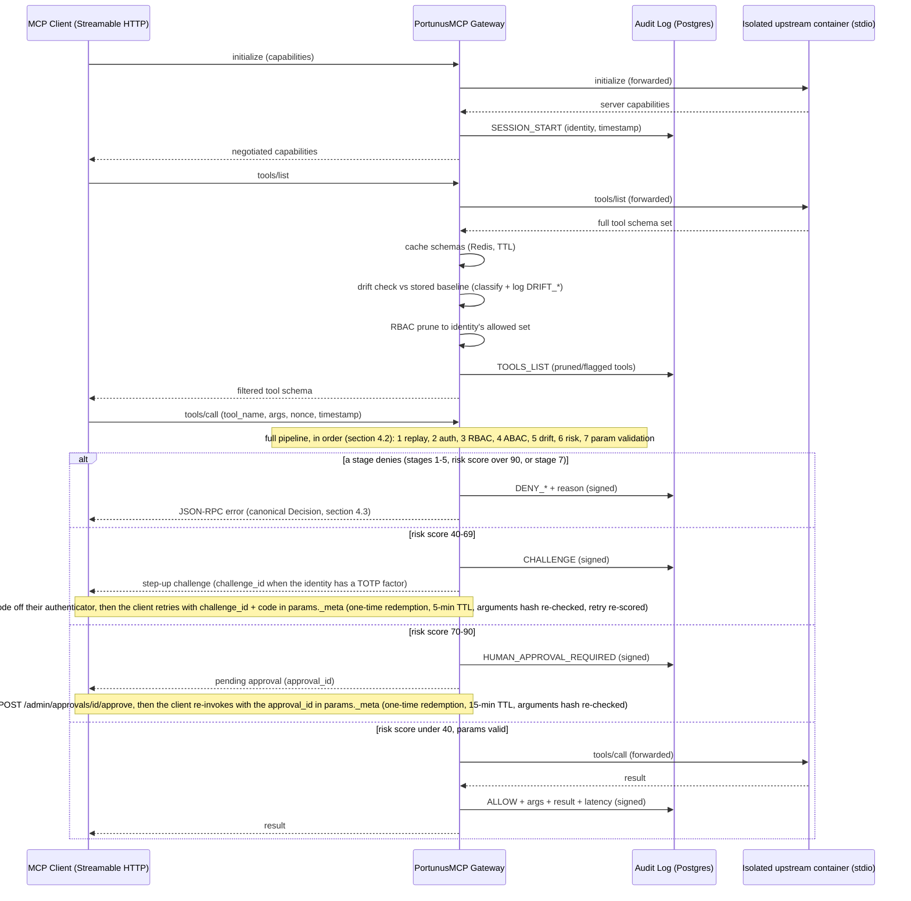
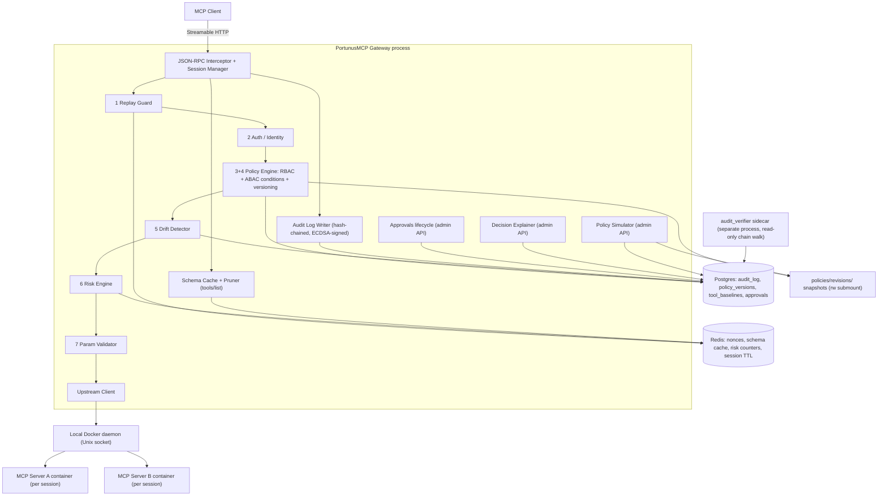
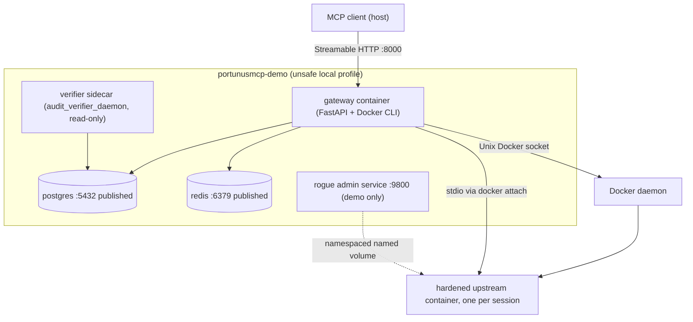
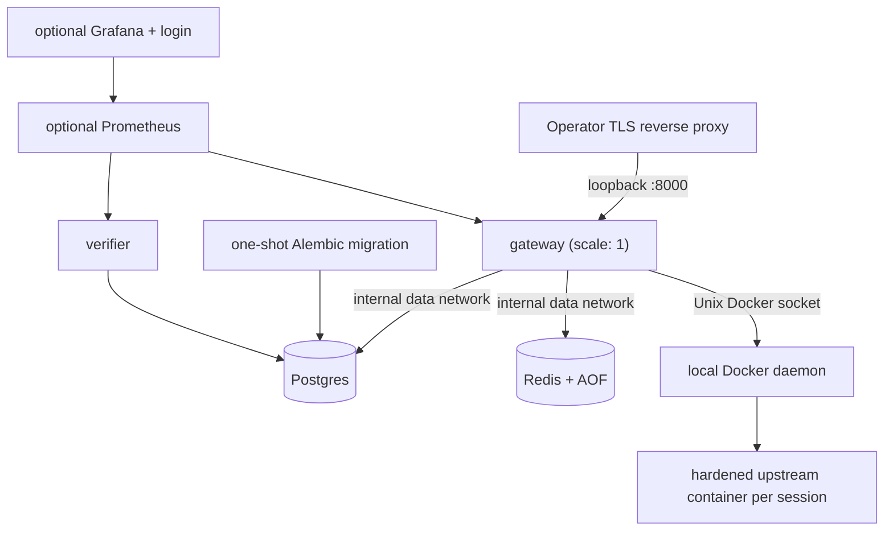
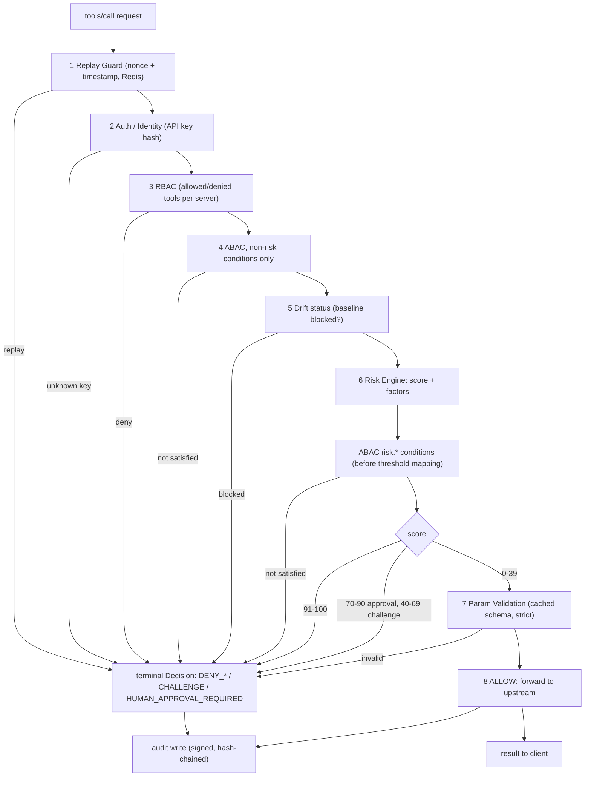

# Architecture

Core design of PortunusMCP: the decision pipeline, every component, failure behavior, hardening, observability, and how it's tested, built, and deployed. See [`README.md`](./README.md) for the pitch and [`THREAT_MODEL.md`](./THREAT_MODEL.md) for what this design does and doesn't protect against.

> Section numbers below start at 4 and internal cross-references (e.g. `§4.5`, `§5`) refer to headers within *this file* — the numbering is inherited from when this was one combined spec document and preserved here so nothing needed renumbering during the split.

---

## 4. Core Architecture

### 4.1 High-level flow

The client-facing transport is **Streamable HTTP** (the MCP spec deprecated the standalone SSE transport in 2025-03); the upstream side is stdio to a dedicated hardened Docker container per session (see §4.8, Session Manager, and ADR-007).



`tools/list` deliberately does **not** run the full pipeline — it forwards upstream, caches the schemas, runs the drift check (classification + logging; blocking is enforced per-call at pipeline stage 5), and prunes the response to the identity's RBAC allow-set. Full enforcement happens on every `tools/call`:

> **Design principle, stated explicitly:** `tools/list` pruning is a *planning-surface* control — it shapes what an LLM even considers as an option — and is not itself a security boundary. Nothing prevents a client from calling a tool name it already knows about (from a prior session, from documentation, from having guessed) without ever re-issuing `tools/list`. Therefore **every `tools/call` independently re-runs the full decision pipeline** (below) regardless of whether that tool appeared in the most recent pruned list served to that client. Relying on "the client didn't see it in the menu" as the actual enforcement mechanism is a well-known pitfall — the real boundary is authorization checked fresh at the point of action, every time.

### 4.2 Decision Pipeline (precedence, explicit)

RBAC, ABAC, drift status, and risk scoring are described as separate mechanisms, but a request is only ever resolved by one deterministic, ordered pipeline — never by asking "did any of these say no" without a defined order, since that leaves the outcome of a disagreement (e.g. RBAC allow + ABAC allow + Risk deny) undefined. The pipeline runs top to bottom; the first stage that produces a terminal outcome ends evaluation there — nothing further downstream is consulted:

```
1. Replay Guard        → fail        → DENY (terminal, cheapest check, runs first)
2. Auth / Identity      → fail        → DENY (terminal)
3. RBAC                 → deny        → DENY (terminal)
4. ABAC conditions       → deny        → DENY (terminal)
5. Schema Drift status  → blocked     → DENY (terminal, tool not currently approved)
6. Risk Engine score    → > 90        → DENY (terminal)
                         → 70–90       → HUMAN_APPROVAL_REQUIRED (terminal, distinct from ALLOW)
                         → 40–70       → CHALLENGE (terminal, distinct from ALLOW)
                         → < 40        → continue
7. Parameter Validation → invalid     → DENY (terminal)
8. → ALLOW → forward to upstream server
```

Every stage is a pure function taking the same request context and returning either `CONTINUE` or a terminal `Decision` (see 4.3 below); this makes each stage independently unit-testable and makes "why did this get denied" always answerable by "which stage stopped it," never ambiguous. Cheapest/cheapest-to-verify checks run first (replay and auth are simple Redis/hash lookups) so an obviously-invalid request never reaches the more expensive policy and risk evaluation.

### 4.3 Canonical Decision Object

Every terminal outcome from the pipeline above — whether returned as a JSON-RPC error to the client, written to the audit log, or served by the Decision Explanation endpoint — is the same shape, defined once and reused everywhere rather than left as three slightly different ad-hoc JSON examples:

```json
{
  "decision": "deny",
  "event_type": "DENY_REPLAY",
  "reason": "Replay detected: nonce already seen within the timestamp window",
  "matched_rules": ["replay_guard"],
  "risk_score": null,
  "policy_version": 12,
  "audit_id": "a1b2c3..."
}
```

```json
{
  "decision": "human_approval_required",
  "event_type": "HUMAN_APPROVAL_REQUIRED",
  "reason": "delete_repo on protected repository outside business hours",
  "matched_rules": ["policy-v12:rule-4"],
  "risk_score": 81,
  "risk_factors": [
      { "factor": "protected_repository", "contribution": 30 },
      { "factor": "business_hours", "contribution": 25 },
      { "factor": "prior_denial_rate", "contribution": 26 }
  ],
  "policy_version": 12,
  "audit_id": "d4e5f6..."
}
```

`event_type` is drawn from one canonical enum (superseding the scattered event names used loosely elsewhere in earlier drafts of this spec): `SESSION_START`, `TOOLS_LIST`, `ALLOW`, `DENY_RBAC`, `DENY_ABAC`, `DENY_REPLAY`, `DENY_DRIFT`, `DENY_RISK`, `DENY_VALIDATION`, `DENY_APPROVAL_MISMATCH`, `DENY_STEP_UP`, `CHALLENGE`, `HUMAN_APPROVAL_REQUIRED`, `APPROVED`, `EXPIRED`, `DRIFT_LOW`, `DRIFT_MEDIUM`, `DRIFT_HIGH`, `DRIFT_CRITICAL`, `POLICY_ACTIVATED`, `POLICY_ERROR`. Splitting `DENY` by cause (`DENY_RBAC` vs `DENY_REPLAY` vs `DENY_RISK`, etc.) rather than logging a generic `DENY` everywhere is what makes the audit log directly queryable for analytics ("show me all risk-based denials this month") instead of needing to parse the `reason` string to find out why.

### 4.4 Component diagram

Every box inside the gateway subgraph is a module in `services/gateway/` with the same name. The pipeline stages (numbered) are wired in §4.2 order by the JSON-RPC Interceptor; the admin-surface components (Approvals, Decision Explainer, Policy Simulator) sit off the live request path.



Edges elided for readability: Auth bumps the gateway-wide auth-failure counter in Redis on wrong-key attempts; the Interceptor bumps the per-identity denial counter in Redis on every `DENY_*` terminal; the Decision Explainer reads the shared schema cache for dry-run param validation. The verifier sidecar reads only the public signing key — the private key never leaves the gateway process.

### 4.5 Deployment diagrams

**(a) Explicit demo profile (`compose.demo.yml`).** This intentionally unsafe local stack publishes Postgres, Redis, the rogue mutation endpoint, and optional anonymous monitoring. It uses default development credentials and tag-pinned images. The fixed `portunusmcp-demo` project name and explicit file/env arguments prevent it from being mistaken for the production profile. The actual rogue MCP server still runs through the same isolated per-session container model; the `rogue` service only hosts its demo mutation/status surface.



**(b) Supported production profile (`compose.prod.yml`).** Production is one hardened gateway replica on one Docker host. The gateway is loopback-published for an operator-managed TLS reverse proxy. Postgres and password-protected, AOF-backed Redis have no host ports and live on an internal data network. A one-shot migration container must complete before gateway/verifier startup. Optional Prometheus/Grafana use the edge/metrics network, loopback-only UIs, persistent data, and required Grafana login. All service images are digest-pinned; every policy-registered production upstream should be too.



Every production service has a read-only root, dropped capabilities, no-new-privileges, memory/CPU/PID limits, bounded Docker JSON logs, and only its required writable volumes/tmpfs. The gateway receives one active policy file, one writable revision directory, the private audit key, and the Docker socket; the verifier receives only the public key. Production gateway-only policy secrets live in a separate env file rather than exposing Compose/Grafana credentials to the gateway.

The gateway's Docker socket is intentionally **root-equivalent access to the host**. It creates the boundary between upstreams and gateway secrets, but means a shell compromise of the gateway is a host compromise. `DOCKER_GID` grants socket access explicitly; this is an operator trust decision, not a sandbox.

The single-replica constraint is correctness, not sizing advice: Session Manager/container handles are in memory, and item 23 experimentally proved two audit-writer instances can fork the chain. Remote Streamable-HTTP upstreams, a distributed atomic audit writer, and true multi-replica operation remain explicitly deferred. Terraform/ECS is likewise deferred; `compose.prod.yml` is its compose-level prerequisite, not a substitute claim that cloud infrastructure exists.

### 4.6 Data flow diagram (single request, all stages)

One `tools/call`, in exact §4.2 order. Note the ABAC split (item 17): conditions with no `risk.*` reference run at stage 4; `risk.*` conditions run immediately after scoring but *before* the 40/70/90 threshold mapping, so a failing `risk.score < 60` is `DENY_ABAC` even when the raw score would otherwise map to CHALLENGE or approval. Every terminal outcome — deny, challenge, approval-hold, or allow — ends in a signed, hash-chained audit write. The admin-only paths (`/admin/decisions/*`, `/admin/policy/simulate`) are deliberately absent: they dry-run this pipeline out-of-band (§4.8) and never sit in the live request path.



### 4.7 Multi-Server Trust Domains (discussion, not implemented)

**Why v1 treats every registered server as equally trusted.** The gateway's trust boundary today runs *between* the client and the upstream — never *between* upstreams. Any server named in the policy file is, once connected, as trusted as any other: same pipeline, same risk factors, same drift thresholds. That's the right call for v1's deployment shape — a single operator registers every upstream by hand (the policy's `servers:` block), so registration *is* the trust decision, made by a human, out of band. It matches `THREAT_MODEL.md`'s posture of drawing scope boundaries explicitly: the threat model already trusts Redis and Postgres inside the deployment's network boundary for the same reason. What v1 *does* defend against per-server is behavioral: the Drift Detector catches a registered server that changes shape after approval (the rug-pull), regardless of who owns it.

**Where that assumption breaks.** The moment servers have different owners, "registered = trusted" stops describing reality:

- **Third-party MCP servers** (a vendor's hosted server, a community server off a registry): the operator can audit the schema at registration time but controls neither the code nor the release cadence. Drift detection catches changes after the fact; it can't express "this server starts from a lower baseline of trust."
- **Team-owned vs org-owned servers**: an internal platform team's server that went through security review shouldn't be scored identically to a side-project server someone registered for their own agent — yet today the only lever is enumerating tools per `server_id`, which encodes *authorization*, not *confidence*.
- **Drift history as a trust signal**: a server whose schema has mutated five times this month is inherently less trustworthy than one stable for a year. The item-18 drift-history risk factor already implements exactly this signal *per tool*; a trust tier is the same idea lifted to the server as a whole.

**The extension point: `trust_tier` on server registration.** The typed server registry could later carry an admin-assigned tier (with an optional numeric score for the Risk Engine), sketched here as policy YAML — **these keys are not implemented; the policy loader rejects them today**:

```yaml
# SKETCH ONLY — not implemented; shown as the designed extension point.
servers:
  github-mcp:
    image: "ghcr.io/acme/github-mcp@sha256:..."
    command: ["github-mcp"]
    trust_tier: "org-verified"     # org-verified | team-owned | third-party
    trust_score: 90                # 0-100, admin-assigned; drift history could decay it
```

Two consumers, both fitting mechanisms that already exist:

1. **Risk Engine factor.** A `server_trust` factor is one more `evaluate(ctx) -> RiskFactor` function appended to the fixed factor list (§4.8) — low trust contributes weight, high trust contributes nothing; no engine change. The same `delete_repo` call then scores higher through the community server than through the org-verified one, and can cross the CHALLENGE or approval threshold on that difference alone. Decay rules would mirror item 18's boundary: an admin approving one call must not erase a server's instability record, so `server_trust` would be non-decayable like `drift_history`.
2. **Policy scoping by tier.** Grants could say `conditions: ["server.trust_tier == 'org-verified'"]` (a third attribute root alongside `identity.*`/`context.*`/`risk.*` — an evaluator vocabulary addition, not a language change) instead of enumerating `server_id`s. This matters operationally once registered servers outgrow hand-enumeration: "read-only tools on any third-party server, write tools only on org-verified ones" is one rule, not one per server.

**Explicit non-goals for v1:** no per-server trust scoring, no `trust_tier`/`trust_score`, and no automatic tier derivation from drift history. Multi-server registration/routing exists; trust tiers remain documented-only future work in `ROADMAP.md` item 29.

### 4.8 Component responsibilities

**Session Manager** — owns one client↔gateway↔server session. It reserves one of three default per-identity session slots before the fail-closed `SESSION_START` write and container launch; starting, active, and stopping sessions all retain that slot, and partial creation failures reap any spawned container before releasing it. It also owns the five-default per-identity in-flight quota and active `(session_id, request_id)` set for `tools/call`. A call has one 60-second end-to-end deadline covering authorization, audit, upstream execution, and response delivery. HTTP disconnection is not cancellation: the slot remains until the upstream response or deadline. A deadline queues JSON-RPC `-32005` when possible, makes the old session unavailable, and reaps its container and every outstanding call. Each session has its own container and runtime fingerprint.

**Container lifecycle and policy activation:** `DockerRuntime` accepts only a local Unix Docker daemon. Startup removes containers carrying this gateway namespace's management labels, then preflights every configured image and namespaced volume; any failure aborts startup before policy activation. SIGHUP performs the same preflight before swapping policy and keeps the last-known-good policy on failure. Rollback returns HTTP 409 if its historical runtime is unavailable. After a successful reload or rollback, the Session Manager disconnects only sessions whose runtime fingerprint changed; cleanup errors are logged but never stop the remaining disconnects.

The fixed launch posture is UID 65532, read-only root, 16 MiB `noexec,nosuid,nodev` `/tmp`, init, `no-new-privileges`, all capabilities dropped, `--pull never`, and memory/CPU/PID limits (defaults 256 MiB, 0.5 CPU, 64 PIDs; memory swap equals memory). Network is `none` unless `bridge` is explicit. Policy `env` maps container destinations to host-variable sources prefixed `PORTUNUSMCP_UPSTREAM_`; no ambient gateway environment is inherited. Named volumes are namespace-bound and read-only. See ADR-007.

**HTTP edge + JSON-RPC Interceptor** — before auth or SDK transport handling, every `/mcp/*` request passes the MCP SDK's Host/Origin validator. POST bodies are bounded by declared and streamed size (1 MiB), decoded as strict UTF-8, scanned for a maximum object/array depth of 32 with string/escape awareness, parsed by stdlib `json`, and validated through the SDK's JSON-RPC model; the unchanged bounded bytes are then replayed to the transport. Only a valid sessionless `initialize` may create a session. Authenticated `tools/call` attempts are fixed-window rate-counted even when their server/session is invalid, their id is already active, or they are notification-shaped (notifications are rejected rather than entering pass-through). The Interceptor then matches `method` against a handler (`initialize`, `tools/list`, `tools/call`, `resources/list`, `resources/read`, `prompts/list`, etc.) and routes it. Any other valid session method is passed through unmodified but still logged.

**Policy Engine** — loads a YAML policy file at startup (hot-reloadable via file watch or SIGHUP), validates it against a Pydantic schema, and exposes `resolve(identity, server_id, tool_name, context) -> Decision`. The base grant is still RBAC (`allowed_tools` / `denied_tools` per identity per server — this stays because it's simple and covers 90% of cases cheaply), but each rule can carry an optional ABAC condition evaluated against typed attributes at call time:

```yaml
version: 4
servers:
  github-mcp:
    image: "ghcr.io/acme/github-mcp@sha256:..."
    command: ["github-mcp", "--stdio"]
    env:
      GITHUB_TOKEN: PORTUNUSMCP_UPSTREAM_GITHUB_TOKEN
    network: none
    resources: {memory_mb: 256, cpus: 0.5, pids: 64}
identities:
  - id: "agent-readonly-01"
    api_key_hash: "sha256:..."
    allowed_servers:
      - server_id: "github-mcp"
        allowed_tools: ["list_issues", "get_pr"]
        denied_tools: ["merge_pr", "delete_repo"]
      - server_id: "filesystem-mcp"
        allowed_tools: ["read_file"]
  - id: "agent-fullaccess-ops"
    api_key_hash: "sha256:..."
    allowed_servers:
      - server_id: "*"
        allowed_tools: ["*"]
        conditions:
          - "identity.team == 'engineering' and context.hour < 20"
          - "risk.score < 60"
```

Conditions are parsed once at policy load into a small AST (a hand-rolled boolean expression grammar over dotted attribute paths, comparison operators, and `and`/`or`/`not` — not a general-purpose language, just enough for identity/tool/context/risk attributes) and evaluated per call. The grammar is deliberately constrained and this is stated explicitly rather than left implicit: **no loops, no recursion, no arbitrary code execution, no user-defined functions — fully deterministic, side-effect-free evaluation only.** This is what makes the DSL safe to evaluate on every single call without a sandbox and easy to reason about in a security review; it's a constrained rules language, not a scripting language. This gets you real ABAC expressiveness without adopting OPA/Rego or Cedar; see the "Why Not" section below for the reasoning on why those aren't used for v1.

**Missing-attribute handling, specified precisely:** if a condition references an attribute that isn't present in the request context (e.g. `context.hour < 20` where the incoming context has no `hour` key), the naive failure mode is an unhandled exception that propagates up and trips the fail-closed behavior in the Failure Modes table (§5) — turning a missing optional field into an availability incident, not a security event. The fix is *not* simply "treat the missing attribute as `False`" injected at the leaf, because that's unsafe once `not` is in play: `not(context.hour < 20)` with a `False` substituted for the missing comparison would evaluate to `True`, silently *granting* access on a rule whose intent was almost certainly the opposite. Instead: **any condition containing an unresolvable attribute reference evaluates the entire condition (not the sub-expression) as not-satisfied**, before any combinator logic (`and`/`or`/`not`) runs on it — this sidesteps the inversion problem entirely, since "not satisfied" is decided prior to negation, not after. Each occurrence also logs a `POLICY_ERROR` event so a genuinely missing/misconfigured attribute is visible in the audit trail as a policy authoring bug, rather than silently changing access outcomes in either direction.

**Policy versioning** — every policy file load is stamped with a monotonic `version` integer and a content hash, and a copy is persisted to `policies/revisions/v{n}.yaml` plus a `policy_versions` table (`version, content_hash, activated_at, activated_by`). Every audit log row records which policy `version` was active at decision time — so replaying or auditing history is always unambiguous about which rules applied. Rollback is just re-activating a prior version row; no full diff-viewer UI is built (that's a frontend project on its own, deferred), but `scripts/verify_audit_chain.py` gains a `--diff-policy v3 v4` mode that prints a structured YAML diff to the terminal, plus an `--html` flag that generates a standalone side-by-side HTML diff page via Python's stdlib `difflib.HtmlDiff` — a small addition (no new dependency) that gives a security reviewer a shareable, browser-openable artifact instead of a terminal dump, without building a real admin UI.

**Schema Pruner** — takes the raw `tools/list` response from upstream and the policy-resolved allow-set, returns only the intersection. Denied tools are removed entirely from the response — not just marked, actually absent — so the LLM client's planning step never sees them as an option.

**Drift Detector** — on first successful `tools/list` for a given `(server_id, tool_name)`, computes a canonical hash over the full schema, and additionally stores the schema itself (not just the hash) so a structured diff is possible. **Canonicalization is explicit, not assumed:** before hashing, the schema object is canonicalized using **`canonicaljson`, pinned to a specific version in `pyproject.toml`** — chosen specifically over the alternative (`python-jcs`) because it has fewer dependencies and a simpler implementation surface, and named as a single concrete choice rather than "an existing library" because the two aren't interchangeable: they handle RFC 8785 edge cases differently (Unicode normalization, `-0` vs `0` number serialization), and silently switching between them would silently change every drift hash without anyone noticing until false alerts start firing. A permanent regression guard is part of the spec, not an afterthought: a smoke test (`test_canonicalization_is_stable_under_key_reordering`) asserts that `canonicaljson.dumps({"a": 1, "b": 2})` and `canonicaljson.dumps({"b": 2, "a": 1})` produce byte-identical output, so a future dependency version bump that changes this behavior fails CI immediately rather than surfacing as a wave of confusing phantom drift alerts in production. This is stated deliberately as "use a pinned library," not "roll your own": a hand-written `json.dumps(sort_keys=True)` approach looks equivalent but silently diverges from RFC 8785 on float formatting, whitespace inside nested arrays, and specific Unicode escape rules. Without correct canonicalization at all, `{"name": "x", "description": "..."}` and `{"description": "...", "name": "x"}` hash differently despite being the identical schema. On every subsequent `tools/list`, the gateway recomputes and diffs field-by-field, then classifies the change instead of treating any change as equally severe:

| Drift type | Severity | Default action |
|---|---|---|
| `description` text changed only | High (default; `DRIFT_DESCRIPTION_SEVERITY`) | Log `DRIFT_HIGH`, block calls until re-approval — the description is the LLM attack surface, so a change after human approval is precisely the rug pull (item 36a); `low` restores the old log-only posture |
| Optional parameter added | Medium | Log `DRIFT_MEDIUM`, allow calls, flag for review |
| Tool removed entirely (no longer in `tools/list`) | Medium | Log `DRIFT_MEDIUM`, no action needed (tool can't be called), flag for review in case it reappears |
| Parameter removed | High | Log `DRIFT_HIGH`, block calls until re-approval |
| A field's `required` status changed, or a type changed | Critical | Log `DRIFT_CRITICAL`, block immediately |
| Tool renamed (a same-shaped tool appears under a new name, or vice versa) | Critical | Log `DRIFT_CRITICAL`, block immediately, treat as a new unapproved tool |

Re-approval is a simple admin-API endpoint: `POST /admin/tools/{server_id}/{tool_name}/approve`, which snapshots the new schema as the accepted baseline and logs an `APPROVE` event. This severity model — not the earlier binary block — is the actual "rug pull" defense; it's what makes the feature usable in practice instead of something operators disable the first time a harmless description edit blocks their pipeline.

**Parameter Validator** — before forwarding a `tools/call`, validates `arguments` against the tool's cached `input_schema` using `jsonschema`, rejects unknown/extra fields (strict mode), and strips common injection patterns from string fields (path traversal sequences, null bytes, control characters). This is defense-in-depth, not a replacement for the upstream server's own validation.

**Risk Engine** — this is the component the original design was missing, and it's the reason identity-based authz alone isn't sufficient. Authz answers "can this identity call this tool at all"; the Risk Engine answers "should this specific invocation, right now, with these arguments, proceed." It's a pure function `score(identity, tool, arguments, context, recent_history) -> RiskScore` returning a 0-100 score plus the contributing factors.

Rather than one monolithic scoring function, each signal is implemented as a small function sharing a common interface (`def evaluate(ctx: RiskContext) -> RiskFactor`, returning a weighted contribution and a human-readable reason string), and the engine iterates a configured list of them and sums the result. This gets you the extensibility story — new signals are a new small function plus a config-file entry, no core-engine changes — without building a real plugin-loading/registration system that nobody but you will ever load a third-party plugin into. The factor list for v1:

- Tool sensitivity tier (static, set in policy: e.g. `delete_repo` = high, `list_issues` = low)
- Blast radius signals where inferable from arguments (e.g. a `repo` argument matched against a static "protected repos" list — production branch names, repos above a star-count threshold)
- Time-of-day / business-hours context
- Call frequency for this identity+tool pair over the last N minutes (a sudden spike is itself a signal), pulled from Redis counters
- Whether the tool's schema is mid-drift-review (an unresolved `DRIFT_MEDIUM` bumps risk even if calls aren't blocked outright)
- **Prior denial rate** for this identity over a rolling window — an identity that's been denied repeatedly is a stronger risk signal than one with a clean history
- **Recent schema drift history** for the target tool, even if already re-approved — a tool that changed shape twice in the last week is inherently riskier than one that's been stable for months
- **Recent authentication failures** for this identity (a small addition to the Auth Layer: one Redis counter incremented on failed API-key lookups, decayed over a rolling window) — a spike in auth failures just before a successful call is a classic credential-stuffing pattern
- **Suspicious baseline** (item 36b): the tool's *approved* description text matched the baseline-time content heuristics (instruction-override phrasing, hidden/zero-width unicode, encoded payloads) — a static property of the tool's content, non-decayable like the sensitivity tier, and honest about being a heuristic: it informs risk, it never blocks

**Determinism is a deliberate design choice, not a placeholder for a future ML model.** This project's value proposition is security, determinism, and explainability — a learned model scoring risk would work against all three: it introduces training-data provenance questions, validation burden, and a decision that can't be fully explained by the Decision Explanation feature below. A weighted, rule-based engine isn't a lesser version of a "real" risk engine here — for this problem, it's the correct architecture, and no ML-based scoring is planned.

**Risk decay — a feedback loop, deliberately not ML.** Denials already feed back into future risk via the prior-denial-rate signal, but the inverse case was missing: when a `HUMAN_APPROVAL_REQUIRED` call is actually approved by an admin, that's real signal too — "a human reviewed this specific high-risk call and judged it fine" — and it wasn't informing anything going forward. The fix is a small per-`(identity, tool)` calibration counter in Redis: each approval decrements that pair's baseline risk contribution by a configurable amount (default -5), floored at 0, via a plain `INCRBY`. This is explicitly a rules-based calibration mechanism, not a learned model — it doesn't touch the weighting logic itself, only a per-pair offset applied before the weighted sum. **One explicit boundary, to prevent this from quietly undermining the risk model over time:** decay only ever discounts the *behavioral* factors (call frequency, prior-denial-rate, drift-in-review) — it never discounts the static tool-sensitivity tier. Without that boundary, repeated rubber-stamp approvals of a tool like `delete_repo` could gradually desensitize the system to a tool that's inherently dangerous regardless of approval history, which would be risk decay working against the system's own purpose rather than for it.

The score maps to an action: **allow** (score < 40), **challenge** (40-70 — a `CHALLENGE` event and a distinct JSON-RPC error; for an identity with a TOTP factor the error carries a one-time `challenge_id` redeemable via step-up auth, see the lifecycle below (item 37), otherwise it stays terminal), **human approval required** (70-90 — call is held pending approval), or **deny** (>90). Every score and its contributing factors are written to the audit log alongside the decision.

**Human Approval Lifecycle** — `HUMAN_APPROVAL_REQUIRED` is a fully-specified state, not a dead end:

- An `approvals` table row is created (`approval_id, audit_id, identity_id, tool_name, arguments_hash, created_at, expires_at, status, approved_by, approved_at`) — tied to the specific `audit_id` of the original decision, **not** to the request's replay nonce (the nonce protects against replay of the original call; the approval needs its own independent identity so it can't be confused with, or extend the life of, that nonce).
- **TTL default: 15 minutes**, configurable per tool sensitivity tier in policy. An approval requested and not acted on within the window transitions to `status=expired` and logs an `EXPIRED` event; the identity must re-request from scratch (the original call is not automatically retried).
- **One-time use:** on approval, the held call is forwarded exactly once; the approval row is marked `consumed` immediately after, and a second attempt to use the same `approval_id` is rejected and logged as `DENY_REPLAY` (approval reuse is itself a replay class).
- **Restart-durable:** because the approval lives in Postgres, not in-process memory, a gateway restart mid-approval doesn't lose the pending state — on restart, the gateway re-checks `expires_at` against the current time for any `status=pending` rows before resuming normal operation.
- Approval is granted via `POST /admin/approvals/{approval_id}/approve`, itself an audited, authenticated admin action (see the Threat Model's Assumptions and the insider-admin non-goal below).
- **TOCTOU re-validation at forward time:** the `approvals` row stores `arguments_hash` at the moment approval is requested, but that alone only proves the arguments were acceptable *then* — it does not guarantee the call actually dispatched carries the same arguments, if the session or client mutated them between approval and dispatch. The gateway therefore **recomputes the arguments hash immediately before forwarding an approved call** and compares it against the stored `arguments_hash`; a mismatch is treated as a distinct terminal outcome (`DENY_APPROVAL_MISMATCH`, added to the canonical event enum in §4.3) rather than silently forwarding either the originally-approved or the mutated arguments. This closes a time-of-check-to-time-of-use gap that a stored hash alone doesn't cover.

**Step-Up Auth Lifecycle (item 37)** — for an identity with a TOTP factor configured (`totp_secret_env` in the policy YAML — the same env-var indirection as `signing_secret_env`, available under either `auth_mode`), `CHALLENGE` is answerable rather than a deny wearing a friendlier name:

- The CHALLENGE decision carries a one-time `challenge_id`. The pending challenge lives in **Redis with a short TTL** (default 5 minutes), pinning the identity, server, tool, and arguments hash — deliberately not a Postgres table like approvals: there is no human queue that must survive a restart, and a dropped challenge is just re-triggered by the next call.
- A human reads a code off their authenticator app (RFC 6238 — 30s step, 6 digits, ±1 step of clock skew; the secret never travels) and the client retries with `portunusmcp/challenge_id` and `portunusmcp/challenge_proof` in `params._meta`.
- Redemption **consumes the challenge atomically first** (one-time use holds whatever else fails), then re-checks identity/server/tool and recomputes the arguments hash — a mismatch is the same TOCTOU class as approvals — then verifies the code and dedups it per identity, so a captured code cannot answer a second challenge within its validity window. Any failure is the terminal `DENY_STEP_UP`.
- **The retry is re-scored.** A verified proof only clears the CHALLENGE band: if the fresh score lands in the approval (70-90) or deny (>90) band, those still stand — step-up can never bypass human approval or `DENY_RISK`. (Approval redemption, by contrast, skips re-scoring: there a human reviewed the exact call; here the human only proved presence.)
- Identities without a factor keep the terminal CHALLENGE, exactly as before item 37.

**Decision Explanation** — every decision the gateway makes (ALLOW, DENY, CHALLENGE, APPROVAL_PENDING) is already backed by a specific set of matched policy rules and risk factors; this feature just exposes that instead of keeping it internal, and it costs almost nothing extra to build since nothing new needs to be computed. Two entry points, same underlying data:

```
GET /admin/decisions/{audit_seq}

→ {
    "decision": "deny",
    "matched_rules": ["policy-v4:rule-12"],
    "risk_score": 74,
    "risk_factors": [
        { "factor": "protected_repository", "contribution": 30, "reason": "repo matches protected list" },
        { "factor": "business_hours", "contribution": 25, "reason": "call made outside 9am-6pm identity timezone" },
        { "factor": "prior_denial_rate", "contribution": 19, "reason": "3 denials for this identity in the last 24h" }
    ],
    "alternative": "human_approval_required"
  }
```

```
POST /admin/decisions/explain
{ "identity": "agent-readonly-01", "tool": "delete_repo", "arguments": {...}, "context": {...} }
```
runs the same evaluation path *without* actually forwarding the call — useful for testing "what would happen if" before a real request is made, and it's the natural companion to Policy Simulation Mode (that one replays history against a candidate policy; this one evaluates a hypothetical single call against the *current* policy). This is arguably the strongest single feature in the whole project alongside Policy Simulation — "why was I denied" is a question every real user of a system like this eventually asks, where policy simulation is admin-only.

**Replay Guard** — the nonce (client-generated UUID) + `timestamp` pair travels in `params._meta`, and whether it is *required* is a property of the identity's `auth_mode` (item 34). For `signed` identities the pair is mandatory on every message and is covered by the request HMAC (see Auth Layer below), which is what makes the dedup meaningful: a byte-identical replay dies here, and a fresh nonce dies at the edge because it cannot be re-signed. For `bearer` identities the pair is opportunistic — a volunteered pair is fully enforced (present-but-malformed is a deny, never a silent skip), but a stock MCP client that sends no `_meta` at all skips the check, which is what lets unmodified clients work; a client-supplied nonce with the API key in the same captured request was never real replay protection anyway. When the check runs: a timestamp outside a configurable window (default ±30s) is rejected, and the nonce is checked against a Redis set with a TTL matching that window; a repeat is `DENY_REPLAY`. Dedup is deliberately `tools/call`-only — replaying a captured `tools/list` re-reads a list, no action.

**Auth Layer (v1)**, fully specified — two per-identity postures, declared as `auth_mode` in the policy YAML (item 34):

- **`bearer` (default)** — client presents an API key in a custom header (`X-PortunusMCP-Key`). The key itself is a high-entropy secret (a 32-byte random value, base64-encoded, generated at identity-creation time via `scripts/generate_api_key.py` and shown to the operator exactly once); the policy store never holds the raw key, only `SHA256(key)`. On each request, the gateway hashes the presented key and looks up the resulting hash directly against the stored identity records — a hash-and-lookup, **not** an HMAC or signing scheme. Works with any stock MCP client; the tradeoff is that the credential rides every request, so a captured request is a stolen key.
- **`signed`** — no secret on the wire at all. The policy holds a *non-secret* `key_id` and the *name* of an environment variable (`signing_secret_env`) the gateway resolves the shared secret from at policy load (fail-closed if unset; secrets never enter the policy file, its revision snapshots, logs, or audit rows). Every request and notification the client sends carries `portunusmcp/key-id` and `portunusmcp/signature` in `params._meta` alongside the nonce/timestamp, where the signature is HMAC-SHA256 over the canonicaljson of `{nonce, timestamp, method, tool, arguments}`. Verification happens at the HTTP edge, before the transport parses the message — any failure is a plain 401. GET (the SSE stream) and DELETE carry no body to sign; they are bound to the session that a signature-verified `initialize` created (residual: possession of a captured session id reads that session's response stream until teardown — see `THREAT_MODEL.md`). `signed` identities cannot be `admin: true` (rejected at load): the `/admin` API authenticates by bearer key only.

A rolling Redis counter tracks failed lookups — wrong bearer keys, unknown key ids, bad signatures — feeding the Risk Engine's auth-failure signal above. No session cookies, no JWTs for v1. OAuth 2.1 On-Behalf-Of token exchange stays a documented later item (this is where you'd map an upstream OAuth token per user identity so the gateway never holds a single shared credential).

**Session idle timeout** — clean disconnect and gateway shutdown cover intentional paths; a Redis TTL (`session:{id}:last_seen`, default 5 minutes, refreshed on each request) covers silent clients. While any call is outstanding, a per-session heartbeat refreshes the key every half-TTL; Redis refresh failure tears the session down fail-closed. The heartbeat stops after the final call completes, so a later genuinely idle session expires and is reaped normally.

**Audit Log** — every decision point (session start, tools/list served, DENY, ALLOW, CHALLENGE, APPROVAL_PENDING, drift detected at any severity, admin approval, policy activation) is written as an append-only row with a hash chain:

```
H_t = SHA256(H_(t-1) || canonical_json(payload_t))
```

On top of the hash chain, every row's hash is additionally signed with an ECDSA (P-256) private key held only by the gateway process (never checked into the repo, injected via Secrets Manager). This closes the gap a plain hash chain has: if an attacker gets write access to Postgres, they can recompute a self-consistent hash chain from a tampered point forward — a hash chain alone only proves internal consistency, not that it wasn't regenerated. A signature can't be forged without the private key, so the verifier checks both the chain math *and* the signature on each row.

**Write-path optimization, without weakening the durability guarantee:** naively, computing `H_t` requires reading the previous row's hash first — a `SELECT MAX(seq)` (or equivalent) before every single insert, which serializes writes more than a typical append-only table would and becomes the first real bottleneck under concurrent load (see §10). The fix is to cache the latest chain hash in a Redis key (`latest_audit_hash`), updated atomically alongside each write (via a Lua script or `WATCH`/`MULTI` transaction so a concurrent writer can't read a stale pointer), removing the Postgres read from the hot path entirely. **The Postgres insert itself stays synchronous** — awaited before the gateway forwards the call upstream — because detaching it via fire-and-forget (e.g. `asyncio.create_task()` with no await) would break the fail-closed "no record, no action" guarantee from §5: if the process crashed or Postgres briefly failed between dispatching a detached write and its completion, a call could execute with no corresponding audit row, which is exactly the ungoverned action this feature exists to prevent. The win from the Redis cache is removing the *slow read* that precedes the write, not removing the write from the critical path.

The existing `ALLOW` row is an authorization-and-dispatch receipt, not proof that the upstream completed successfully. It is deliberately written before dispatch; no completion event was added in item 40. A deadline can terminate the session and container, but it cannot roll back a side effect the upstream began before termination.

Schema (Postgres):

```sql
CREATE TABLE audit_log (
    seq            BIGSERIAL PRIMARY KEY,
    prev_hash      CHAR(64) NOT NULL,
    curr_hash      CHAR(64) NOT NULL,
    signature      BYTEA NOT NULL,      -- ECDSA signature over curr_hash
    timestamp      TIMESTAMPTZ NOT NULL DEFAULT now(),
    identity_id    TEXT NOT NULL,
    server_id      TEXT,
    tool_name      TEXT,
    policy_version INTEGER NOT NULL,
    event_type     TEXT NOT NULL,   -- one of the canonical event types defined in section 4.3
    risk_score     SMALLINT,
    payload        JSONB NOT NULL,
    latency_ms     INTEGER
);
CREATE INDEX idx_audit_identity ON audit_log(identity_id, timestamp);
CREATE INDEX idx_audit_event ON audit_log(event_type, timestamp);
CREATE INDEX idx_audit_policy_version ON audit_log(policy_version);
```

A standalone **audit verifier daemon** runs on a schedule (cron or sidecar container). Rather than walking the entire chain from `seq=1` on every run — an O(n) full scan that becomes impractical to run frequently at exactly the scale the Scalability Discussion (§10) is concerned with — it maintains a `last_verified_seq` checkpoint (a small Postgres table or a single Redis key) and verifies forward from `last_verified_seq + 1` on each run, recomputing hashes and signatures only for rows written since the last check. This turns verification from O(n) into O(recent writes), which is what makes "run this every minute" a credible operational claim rather than an aspirational one. If a broken link or invalid signature is found, the daemon alerts (Prometheus alert + log) immediately and stops advancing the checkpoint past that point — everything downstream of a confirmed break is untrusted regardless of whether it individually re-verifies, so there's no value in continuing past it.

**Policy Simulation Mode** — the single highest-value feature to build, and the one worth prioritizing above almost everything else once the audit log and policy engine exist. Because every historical `tools/call` decision is already stored with its full context (identity, tool, arguments, timestamp, risk factors), and the policy engine is a pure function of `(identity, tool, context) -> decision`, replaying history against a *candidate* policy costs almost nothing extra to build:

```
POST /admin/policy/simulate
{ "candidate_version": 5, "replay_window": "2026-06-01..2026-07-01" }

→ {
    "total_replayed": 41823,
    "would_now_deny": 423,
    "would_now_require_approval": 17,
    "newly_allowed": 12,
    "unchanged": 41371,
    "sample_diffs": [ ... ]
  }
```

This turns "we're about to change the policy" from a leap of faith into a measured decision — a security team can see exactly what a new policy would have done against real historical traffic before activating it. It's also the feature most likely to make a technical reviewer stop skimming and actually read the code, because it's the kind of capability that signals you understand how these systems get *operated*, not just how they get built.

The simulator also supports comparing two non-active policy versions directly against each other, not just "candidate vs. what actually happened":

```
POST /admin/policy/simulate
{ "compare_versions": [2, 5], "replay_window": "2026-06-01..2026-07-01" }

→ {
    "total_replayed": 41823,
    "new_denials_v5_not_v2": 423,
    "new_approvals_v5_not_v2": 12,
    "changed_risk_scores": 891,
    "changed_explanations": 891,
    "sample_diffs": [ ... ]
  }
```

This is the enterprise-grade version of the same idea — instead of only validating a candidate against reality, it answers "how did this policy actually evolve between v2 and v5, in terms of real request outcomes," which is a materially different and more useful question once a policy has gone through several revisions.

---


---

## 5. Failure Modes (fail-open vs. fail-closed, per subsystem)

A security gateway that silently fails open under load or during an outage is worse than one that's honest about degrading — this is stated explicitly per dependency rather than left for a reviewer to guess:

| Subsystem unavailable | Behavior | Rationale |
|---|---|---|
| Redis (replay guard, rate limiting, cache) | **Fail closed** — rate-check failure returns HTTP 503 before the decision pipeline; replay/cache failure denies | If the gateway cannot enforce the per-identity rate window or check whether a nonce was already seen, silently proceeding would remove a security control during the outage. |
| Postgres (audit log write) | **Fail closed** — deny the call before it reaches the upstream server | An action that can't be recorded is, for this project's purposes, an action that shouldn't happen — "no record, no action" is the defensible posture even though it costs availability. This is a deliberate trade-off, stated as such. |
| Postgres (policy store, read-only lookup) | **Fail closed**, but backed by an in-memory last-known-good policy snapshot with a short grace period (default 60s) to absorb brief connection blips without denying everything during a transient reconnect | Distinguishes "database had a one-second hiccup" from "database is actually down," without pretending a stale policy is fine indefinitely. |
| Risk Engine (unhandled exception during scoring) | **Fail closed** — treat the exception itself as maximum risk (equivalent to score 100, i.e. deny) | A crashed risk calculation is not the same as "risk is low"; treating a scoring failure as the worst-case score is the only interpretation that doesn't quietly disable the feature under fault conditions. |
| Local Docker daemon, configured image, or configured named volume unavailable | **Fail closed** — startup aborts; SIGHUP keeps the last-known-good policy; rollback returns 409 | Activating a policy whose isolation runtime cannot be realized must never fall back to an in-process server or weaker launch posture. |
| Upstream MCP server unreachable | **Fail closed** for that server only — return a JSON-RPC error for calls targeting it; does not affect other registered servers or other identities | This isn't a security decision so much as a normal proxy-availability one, included here for completeness. |
| Audit verifier daemon itself down | **No blocking effect on live traffic** — the daemon is a detective control, not a preventive one; its own downtime is monitored separately (a missed-heartbeat alert), since blocking live traffic because a background verifier hasn't run recently would be a disproportionate availability cost for a control that's about catching tampering after the fact, not preventing the call. | |

The consistent theme: every subsystem whose failure would silently weaken a security guarantee fails closed, even at an availability cost, and returns a specific failure rather than passing through unnoticed.

`/health` remains liveness-only. `/ready` runs Postgres `SELECT 1`, Redis `PING`, and an in-memory ECDSA sign/verify probe concurrently under one overall one-second deadline, returning a named `ok|failed` map and HTTP 503 if any check fails. The Compose gateway healthcheck uses `/ready`; it never re-reads the private-key PEM.

---


---

## 6. Security Hardening Checklist

- **Implemented (item 39):** each upstream runs in a dedicated container as UID 65532 with a read-only root, restricted tmpfs, no new privileges, all capabilities dropped, bounded memory/CPU/PIDs, no swap above memory, a minimal allowlisted environment, and no network unless `bridge` is explicit.
- **Implemented (item 40):** strict body/depth bounds, SDK Host/Origin validation, per-identity session/in-flight quotas, a 60-second call deadline, and a Redis fixed-window `tools/call` limit (default 60 per 60 seconds). The fixed window is deliberately simple and permits up to twice the configured count across two adjacent window boundaries; replace it only if measured abuse requires a sliding window.
- **Implemented (item 41):** the production Compose profile is explicit and single-replica, publishes only loopback app/monitoring ports, isolates authenticated Postgres/Redis on an internal network, digest-pins service images, separates gateway-only secrets, and applies read-only roots, dropped capabilities, no-new-privileges, resource ceilings, restart policies, and bounded local logs.
- Never log full argument payloads for tools flagged as handling secrets (policy field: `redact_args: true` per tool).
- API keys stored only as salted hashes; raw keys shown once at creation time via admin CLI, never persisted in plaintext.
- The shipped single-host production profile trusts plaintext traffic inside its isolated backend network; a future multi-host deployment must add authenticated TLS between services.
- Dependency pinning + Dependabot/Renovate for the Python side; run `pip-audit` in CI.
- Structured logs never include the API key header value, even in DEBUG mode — implement a logging filter that redacts it.

---


---

## 7. Observability

*Implemented (item 25). Structured logs shipped from day one (item 13); Prometheus/Grafana were added once core gateway logic was stable so effort wasn't split across two problems at once.*

- **Prometheus metrics** (`services/gateway/metrics.py` — exactly this set, no more): `portunusmcp_tool_calls_total{identity, server, tool, decision}` (incremented at the interceptor's three terminal emission points; `decision` = the audit event type; `tool` preserves a name only when it exists in that server's current Redis schema cache, otherwise `other`, including on cache failure), `portunusmcp_schema_drift_total{server, tool, severity}` (Drift Detector classification writes), `portunusmcp_risk_score` (histogram, observed once per freshly scored call whatever the eventual outcome), `portunusmcp_request_latency_seconds` (histogram, decision-pipeline time per `tools/call` — proxy overhead only, the upstream round trip is excluded), `portunusmcp_audit_chain_verify_failures_total` (verifier failure branch — alert on any increase; this replaced item 11/13's `logger.error`-only alerting), `portunusmcp_replay_denied_total`.
- **Exposure posture:** unauthenticated but internal-only. Metric labels carry identity ids and tool names, so `/metrics` is never served on the published app port — the gateway starts a separate listener on `METRICS_PORT` (default 9100; the verifier sidecar uses 9101, skipped under `--once`), and neither Compose file publishes those ports. Prometheus scrapes them over the Compose network. Metric increments are in-memory and cannot meaningfully fail — no fail-open/fail-closed posture applies.
- **Prometheus + Grafana containers:** both explicit Compose files have an opt-in `monitoring` profile. Demo publishes anonymous local Grafana; production binds both UIs to loopback, requires a Grafana login, persists their state, and applies the production hardening/limits.
- **Grafana dashboard** (`monitoring/grafana/dashboards/portunusmcp.json`, provisioned automatically): panels for allow/deny/challenge rate over time, top denied tools, drift events timeline by severity, risk score distribution, p50/p95/p99 pipeline latency.
- **Structured logs (structlog, JSON):** one line per decision, correlation ID = session ID, shippable to any log aggregator. Shipped in MVP regardless of the Prometheus/Grafana timeline.

---

## 8. Cache Invalidation

The gateway caches two things per `(server_id)`: the last-seen tool schema set (used by the Drift Detector) and the resolved policy for fast-path lookups. Both need explicit invalidation rules, not just implicit "recompute on read":

- **Schema cache:** invalidated and re-fetched on every `initialize` for a session (a fresh handshake is the natural trust boundary to re-verify against). Additionally carries a TTL (default 10 min) so a long-lived session doesn't trust a stale schema indefinitely between handshakes — on TTL expiry the gateway transparently re-issues `tools/list` upstream and re-runs the drift check before serving the next client request.
- **ETags:** the gateway's own `tools/list` response to the client includes an ETag derived from `(policy_version, schema_hash)`; a client that supports conditional requests can skip re-parsing an unchanged tool list.
- **Policy cache:** invalidated immediately on SIGHUP reload. The candidate container runtime is preflighted before swap; after success, sessions whose runtime fingerprint changed are disconnected while unchanged sessions continue and resolve calls against the new policy.

---


---

## 9. Performance Benchmarks

A proxy that adds meaningful latency to every tool call is a hard sell regardless of its security value, so this gets measured and published in the README, not estimated — invented-looking numbers in a security tool's documentation are worse than no numbers at all, since a technical reviewer will assume they're fabricated the moment they can't be reproduced.

### Method

`tests/benchmarks/run.py` runs N=1000 sequential `tools/call` round trips via the MCP client SDK, timed with `time.perf_counter()`:

- **direct** = stdio client straight at `sample_target/benchmark_server.py`;
- **gateway** = the same calls through one in-process gateway, with the full §4.2 pipeline active (Replay Guard → auth → fixed-window rate check → RBAC + ABAC conditions → drift check → Risk Engine scoring across all eight factors, Redis-backed behavioral counters included → parameter validation → hash-chained audit write with per-row ECDSA P-256 signing). Body/depth/deadline and Host/Origin validation remain active. The harness derives only its workload ceilings: session and in-flight limits equal maximum concurrency, and rate allowance equals the computed gateway call count.
- **Overhead** = gateway − direct.
- **Cold cache** deletes the Redis schema key before every timed call, forcing an upstream `tools/list` re-fetch plus drift check per call. The direct path has no cache, so its column repeats the baseline.
- **Container initialization** measures the first launch plus 20 warm launches. Concurrency levels run 20 calls per session at 10/50/100 sessions, each session owning a real hardened Docker container.
- **Memory** records the gateway+harness process RSS and the aggregate initialized upstream-container memory after the 100-session run.

It also measures the **`tools/list` response size reduction** from schema pruning. Every other metric here answers "how much overhead does the gateway add"; pruning is the one genuine positive claim — smaller wire responses and fewer tokens for the LLM parsing the tool list.

### Results

Measured **2026-07-27** from the item-40 working tree based on **`d12ddb2`**, on Darwin 24.6.0 arm64 (Apple Silicon), Python 3.12.13, Postgres 16, Redis 7, and local Docker. Latencies are mean / p50 / p95 / p99.

| Scenario | Direct call | Through gateway | Overhead |
|---|---|---|---|
| Single call, cached schema | 0.28 / 0.22 / 0.54 / 1.11 ms | 16.75 / 16.18 / 18.12 / 31.53 ms | 16.47 / 15.95 / 17.58 / 30.42 ms |
| Single call, cold schema cache | 0.28 / 0.22 / 0.54 / 1.11 ms | 19.57 / 18.93 / 21.86 / 44.81 ms | — |
| 10 concurrent sessions (p95) | — | 145.98 ms | — |
| 50 concurrent sessions (p95) | — | 761.38 ms | — |
| 100 concurrent sessions (p95) | — | 2090.04 ms | — |
| `tools/list` payload size (pruned identity) | 744 B (unpruned) | 425 B | **42.9% reduction** |

Container initialization: first 544.45 ms; next 20 p50 442.97 ms / p95 868.89 ms. Peak RSS after the 100-session run: 212 MiB (gateway and harness share the process); aggregate initialized upstream-container memory: 1,095 MiB. High-concurrency p95 includes Docker container ownership plus synchronous fail-closed audit writes contending on the Postgres pool.

These numbers are published in the README with the exact commit and date they were measured at, so a stale claim is visible as stale rather than quietly wrong.

**Reproduce:** `docker build -t portunusmcp:dev .`, start Postgres/Redis, then run `UPSTREAM_RUNTIME_NAMESPACE=portunusmcp-benchmark .venv/bin/python -m tests.benchmarks.run` (wipes local dev state; reports land in gitignored `tests/benchmarks/reports/`).

- **CI integration:** the benchmark suite runs on every merge to `main` (not every PR, to keep CI fast) and the report is uploaded as a build artifact so latency regressions are visible over time, even without a full dashboard.

---


---

## 10. Scalability Discussion (design considerations, not implemented at this scale)

This project runs as a single instance for the portfolio demo, but the design should hold up under discussion about what changes at 10 / 100 / 1,000 / 10,000 concurrent sessions:

- **The current gateway is single-replica.** Session state and Docker container handles are in memory, and the audit chain has one safe writer. Redis/Postgres hold durable shared state, but that alone does not make horizontal scaling turnkey.
- **Postgres write amplification is the first real bottleneck**, though it's addressed for v1 rather than deferred entirely: the naive approach (`SELECT MAX(seq)` before every insert to compute the next hash) is fixed by caching `latest_audit_hash` in Redis so the read is removed from the hot path, while the Postgres write itself remains synchronous to preserve the fail-closed audit guarantee (see §4.8, Audit Log). At scale well beyond a portfolio demo, this still eventually needs either a single-writer audit service that other gateway replicas call into, or periodic chain-checkpointing instead of chaining every single row — but the Redis-cache fix is sufficient for the load levels this project is actually built and benchmarked against. The multi-replica hazard is no longer just suspected: a two-writer variant of item 23's `test_concurrent_audit_writes_do_not_collide` demonstrated the chain forking experimentally — the Postgres insert commits before the Redis pointer CAS, so a `WatchError` retry orphans the already-committed row (148 rows for 100 writes) — which is why the single-writer audit service (or chain checkpointing) is a prerequisite for scaling gateway replicas that write audit rows, not an optional optimization.
- **Redis is the second consideration** — replay-nonce sets and rate-limit counters are high-churn but low-value-per-key, which is exactly what Redis is good at; at very high scale this becomes a cluster-mode Redis deployment rather than a single instance, which is a config change, not an architecture change.
- **Container launch and connection ownership** — each local session owns a Docker container and stdio attachment. Launch latency and aggregate container memory become explicit ceilings at high concurrency; these are measured at 10/50/100 sessions in §9.

None of this is built or load-tested at those scales for v1 — it's written here so a technical reviewer sees the bottlenecks were considered, not undiscovered.

---

## 11. Testing Strategy

- **Unit:** policy resolution logic (RBAC + ABAC condition evaluation), schema hashing and diff classification, risk scoring function, param validator edge cases (nested objects, arrays, unicode).
- **Integration:** spin up the gateway + a real (mock) MCP server in Compose, drive full `initialize → tools/list → tools/call` sequences via the actual MCP client SDK.
- **Production Compose:** render the digest-only production contract, then use local-image test overrides to boot its core + monitoring services, assert isolation/hardening, and drive `initialize → tools/list → tools/call` through the real per-session container runtime.
- **Resource/lifecycle:** `tests/integration/test_resource_limits.py` uses a tiny async sleep tool to cover declared and streamed body limits, JSON depth/encoding/model validation, SDK Host/Origin checks, session/in-flight/rate boundaries and failure semantics, deadline reaping, and in-flight idle heartbeats. `tests/unit/test_readiness.py` covers named dependency/signing failures and the one overall readiness deadline; metrics tests prove arbitrary denied names collapse to `tool="other"`.
- **Adversarial suite (this is your differentiator in interviews):**
  - Simulate a rug pull at each severity tier: description-only change (should not block), required-field change (should block), tool rename (should block as new/unapproved) — assert correct classification and correct action per tier.
  - Simulate tool poisoning: inject adversarial text into a tool description, assert the gateway doesn't execute anything based on description content (it shouldn't — description is passed through to the client only after prune, never executed).
  - Simulate a replay attack: identical nonce+timestamp resubmitted, assert `DENY_REPLAY`; then assert a request just outside the timestamp window is also denied.
  - Simulate a high-risk call (e.g. `delete_repo` on a policy-flagged production repo outside business hours) and assert it lands in `APPROVAL_PENDING`, not `ALLOW`.
  - Run the Policy Simulation endpoint against a fixture audit log and a deliberately stricter candidate policy, assert the reported `would_now_deny` count matches a hand-computed expected value.
  - Fuzz `input_schema` and `arguments` with `hypothesis` to find validator crashes.
  - Assert an ABAC condition referencing a missing context attribute resolves the whole condition as not-satisfied — including specifically inside a `not(...)` wrapper, to catch the inversion bug directly rather than only its non-negated form.
  - Simulate the human-approval TOCTOU case: request approval, mutate the arguments before the call is dispatched, assert `DENY_APPROVAL_MISMATCH` rather than either the original or mutated arguments being forwarded.
  - `test_concurrent_audit_writes_do_not_collide`: fire 100 concurrent `audit_log.write()` calls against the Redis-cached `latest_audit_hash` pointer and assert every resulting `seq` is unique and the hash chain is fully contiguous with no gaps or duplicate `curr_hash` values. The atomicity of the Redis-cached pointer update (via Lua script or `WATCH`/`MULTI`) is a claim made in prose in §4.8 — this is the test that actually exercises it, since a stale-pointer race under concurrent writers is exactly the kind of bug that would otherwise only surface under real production load, silently corrupting the chain.
- **Coverage gate:** `--cov-fail-under=80` in CI, same pattern as ProdRescue.

---


---

## 12. CI/CD Pipeline (GitHub Actions)

```
on: [push, pull_request]
jobs:
  lint:       ruff check, ruff format --check
  typecheck:  mypy --strict services/
  test:       pytest --cov=services --cov-fail-under=80
  benchmark:  runs on merge to main only, uploads latency report artifact
  build:      docker build (multi-stage, non-root final image)
  push:       on tag → push to GHCR and publish the immutable digest in the job summary
```

---


---

## 13. Deployment

- **Demo:** `compose.demo.yml` is explicitly unsafe and local-only: default credentials, published data ports, rogue mutation service, tag-pinned images, and optional anonymous monitoring.
- **Production:** `compose.prod.yml` is the one supported self-hosted deployment: a hardened single-replica gateway/verifier plus local Postgres/Redis, one-shot migrations, digest-pinned images, narrow secret/file mounts, internal data networking, and optional secured monitoring. TLS termination, backups, host hardening, and log shipping are operator responsibilities.
- **Not built:** Terraform/ECS, remote network upstreams, inter-service mTLS, and multi-replica gateway coordination. Multiple replicas are unsafe until session/container ownership is externalized and the audit chain has a distributed atomic writer. Kubernetes remains deliberately out of v1 (ADR-005).

---
