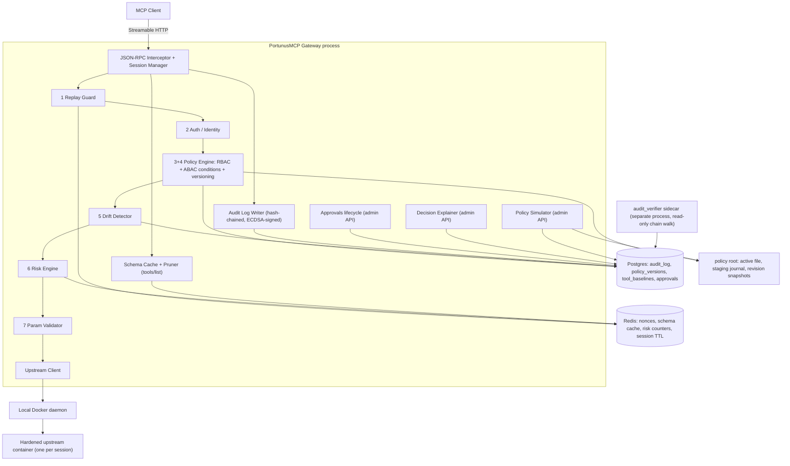

# PortunusMCP

**A policy-enforcing gateway proxy for the Model Context Protocol (MCP)** — identity-scoped tool visibility, schema-drift ("rug pull") detection, per-call risk scoring, and a tamper-evident signed audit trail, with no changes required to the upstream MCP server.

[](https://github.com/BashaarJavaid/PortunusMCP/actions/workflows/ci.yml)
-brightgreen)

[](./LICENSE)


*A low-privilege identity sees only the tools it's allowed. The upstream server rug-pulls its own schema mid-session. The gateway classifies the drift as Critical, blocks the call, and holds it for human re-approval. A byte-identical replay is rejected. Finally, a draft policy is simulated against the traffic that just happened.*

---

## Why

MCP defines a JSON-RPC 2.0 transport between LLM clients and tool servers, but deliberately leaves authorization, auditability, and integrity out of scope — it assumes the deploying org builds that layer. In practice almost nobody does, which leaves three concrete gaps:

1. **No identity-scoped tool visibility.** Any client that can reach a server gets the server's full `tools/list`. There is no native "this user should only see a subset of tools."
2. **Rug pulls.** A server can change a tool's schema *after* a human approved it in a prior session, with nothing to detect the drift.
3. **No audit trail.** Nothing records which identity invoked which tool with which arguments, under which policy, in a form you could later prove wasn't edited.

PortunusMCP sits between the two and closes those three.

### Client compatibility

The upstream server is proxied unchanged. The default `bearer` mode works without client source changes when the client can attach `X-PortunusMCP-Key` to a remote MCP connection.

| Client | Result | Evidence |
|---|---|---|
| [Claude Desktop](https://support.claude.com/en/articles/11175166-get-started-with-custom-connectors-using-remote-mcp) 1.20186.0 | **Incompatible with bearer** | The remote custom connector could not attach the header; it received 401, then attempted OAuth discovery and dynamic client registration. |
| [Cursor](https://docs.cursor.com/context/model-context-protocol) 3.13.10 | **Compatible** | The user-level configuration below connected and `tools/list` served `send_email` and `read_inbox` while pruning `delete_mailbox`; the signed audit row recorded the same set. |
| Python MCP SDK 1.28.1 `ClientSession` | **Compatible** | The stock streamable-HTTP client produced the same pruned `tools/list`; the integration suite exercises this path end to end. |

These are point-in-time results from 2026-07-27 on macOS 15.7.3 arm64. Cursor's tested user-level `~/.cursor/mcp.json` entry was:

```json
{
  "mcpServers": {
    "portunusmcp": {
      "url": "https://gateway.example.com/mcp/default",
      "headers": {
        "X-PortunusMCP-Key": "${env:PORTUNUSMCP_API_KEY}"
      }
    }
  }
}
```

Launch Cursor with `PORTUNUSMCP_API_KEY` available in its environment; do not put the raw key in a committed file. The equivalent SDK connection is:

```python
import os

from mcp import ClientSession
from mcp.client.streamable_http import streamable_http_client

headers = {"X-PortunusMCP-Key": os.environ["PORTUNUSMCP_API_KEY"]}
async with streamable_http_client(
    "https://gateway.example.com/mcp/default", headers=headers
) as (read, write, _):
    async with ClientSession(read, write) as session:
        await session.initialize()
        tools = await session.list_tools()
```

Auth posture is per-identity ([`ROADMAP.md`](./ROADMAP.md) item 34): identities that can adopt a small signing client opt into `signed` mode, where the request carries a non-secret key id plus an HMAC over the call — no credential on the wire at all, which is what makes replay protection real (a captured request cannot be re-signed with a fresh nonce). The tradeoff is honest: `bearer` = stock client plus header configuration, key rides the request; `signed` = custom client, capture-proof.

---

## Architecture

Every box inside the gateway is a module in `services/gateway/` with the same name; numbered stages are the decision pipeline in `ARCHITECTURE.md` §4.2 order. Sequence, deployment, and data-flow diagrams live in §4.4–§4.7.



**Multiple upstreams are registered in the policy's `servers:` block** as typed container specifications, versioned and rolled back with the rest of the policy. Clients connect to `/mcp/<server_id>`; one session owns one hardened upstream container. RBAC grants, drift baselines, schema caches, risk counters, approvals, and runtime fingerprints are keyed on the real `server_id`.

```yaml
servers:
  github:
    image: "ghcr.io/acme/github-mcp@sha256:..."
    command: ["python", "-m", "github_mcp"]
    env:
      GITHUB_TOKEN: PORTUNUSMCP_UPSTREAM_GITHUB_TOKEN
    volumes:
      - source: "portunusmcp-upstream-dev-github-config"
        target: "/config"
    network: none
    resources: {memory_mb: 256, cpus: 0.5, pids: 64}
```

The local Docker daemon, every referenced image, and every named volume are preflighted before policy activation; images are never pulled at runtime. Containers run as UID 65532 with a read-only root, a restricted `/tmp`, no new privileges, no capabilities, and bounded memory/CPU/PIDs. Environment values can only come from host variables prefixed `PORTUNUSMCP_UPSTREAM_`; gateway database, signing, TOTP, and audit-key secrets are not inherited. Network defaults to `none`. See [ADR-007](./docs/adr/ADR-007-upstream-container-isolation.md).

---

## Threat model (summary)

The full version, including the assumptions the whole model rests on, is in [`THREAT_MODEL.md`](./THREAT_MODEL.md). It is deliberately explicit about what is *not* covered — an honest scope boundary is worth more than an implied claim of total coverage.

| Threat | Protected? | How / why not |
|---|---|---|
| Unauthorized tool access by a known identity | **Enforce: Yes; Observe: No** | RBAC + ABAC block in `enforce`; `observe` audits the would-be denial and forwards |
| Rogue / rug-pulling MCP server (schema mutation) | **Enforce: Yes; Observe: detects only** | Drift Detector classifies mutations; High/Critical blocks until re-approval only in `enforce` |
| Contextually risky calls by an *authorized* identity | **Enforce: Yes; Observe: advisory** | Risk Engine computes the same score and outcome in both modes; only `enforce` holds or denies |
| Audit-log tampering | Yes | Hash chain + per-row ECDSA signature; independently verified by a sidecar holding only the public key |
| Replay of a captured request | **Enforce: Yes for `signed` / Partial for `bearer`; Observe: detects only** | The nonce check still runs and consumes nonces in `observe`, but a detected replay is forwarded. HTTP signature failures remain 401 in both modes |
| Tool Poisoning (adversarial text in descriptions) | **Enforce: Partial; Observe: weaker advisory detection** | Changed descriptions block only in `enforce`; `observe` still scans, audits, and scores but forwards. Descriptions reach the LLM verbatim in both modes |
| Compromised registered upstream reading gateway secrets | **Yes (scoped)** | Per-session hardened containers receive a minimal allowlisted environment and no gateway secrets directory, Docker socket, or DB/Redis credentials; host/gateway compromise remains out of scope |
| DNS rebinding against Streamable HTTP | **Yes (scoped)** | The MCP SDK validates every `/mcp/*` Host and supplied Origin against configured allowlists before auth or parsing; the deployment must configure its real public names |
| Authenticated resource exhaustion / stuck tools | **Partial** | Per-identity sessions, in-flight calls, fixed-window rate limits, bounded bodies/depth, and a 60s call deadline cap one identity; many identities can still exhaust the host, and a deadline cannot undo an upstream side effect already started |
| Unauthenticated credential stuffing / auth-path availability | **Partial** | Bad bearer/signed credentials are fixed-window throttled by trusted-proxy-resolved source across MCP/admin and raise an alert; address rotation, initial concurrent bursts, and shared-NAT collateral remain |
| Prompt injection via tool *results* | Partial | A protocol-layer gateway can log and rate-limit but not semantically evaluate result content — client/agent-framework responsibility |
| Stolen API key | Partial | Source throttling remains active in both modes; behavioral risk blocks only in `enforce`. A `signed` identity's secret never appears on the wire at all |
| Compromised gateway host | No | The attacker has the signing key — an infra hardening problem, not an application one |
| Insider admin abusing legitimate access | No | Attributable and tamper-evident after the fact, not prevented; two-person activation is designed, not built |

---

## Quickstart

`portunusmcp quickstart` is the evaluation path from an existing local stdio MCP image
to one verified `ALLOW` and one verified `DENY_RBAC`. It creates and starts the real
PostgreSQL, Redis, migration, gateway, and audit-verifier stack; it is not a
SQLite-shaped substitute for the production deployment.

Prerequisites:

- Python 3.12 with `portunusmcp` installed from PyPI.
- Docker Engine and Docker Compose with `/var/run/docker.sock` available (tested
  release line: Engine 29.x and Compose 5.x).
- Linux amd64/arm64 or macOS arm64, running as a non-root user.
- Internet access for the three immutable release images, plus a pre-existing local
  image containing the upstream MCP server. Quickstart never pulls the upstream.

For example, against a local image whose `echo` tool accepts `{"text": ...}`:

```bash
portunusmcp --timeout 300 quickstart \
  --upstream-image my-local-mcp:latest \
  --allow-tool echo \
  --arguments '{"text":"hello"}' \
  --output-dir ./portunusmcp-quickstart \
  --command python -m my_mcp_server
```

`--command` must be last; everything after it is passed as argv without a shell.
Quickstart resolves the supplied image to its local immutable `sha256:...` image ID,
generates two 256-bit bearer credentials and a fingerprint-addressed audit key, binds
the gateway only to `127.0.0.1:8000`, disables upstream networking and environment
passthrough, then prints the full canonical Decisions after independently verifying
the audit export. Raw credentials are written only to the mode-`0600`
`portunusmcp-quickstart/credentials.env` file:

```bash
cd ./portunusmcp-quickstart
set -a && source ./credentials.env && set +a
# PORTUNUSMCP_URL=http://127.0.0.1:8000
# MCP endpoint: http://127.0.0.1:8000/mcp/default
```

The private mode-`0700` work directory also contains `compose.quickstart.yml`,
`.env.quickstart`, `config/policy.yaml`, the revision directory, and
`secrets/audit_signing_key.pem` plus its public-key ring. A successful run leaves the
stack running and prints exact start/restart, state-preserving stop, and destructive
reset commands. Their shapes are:

```bash
docker compose --env-file .env.quickstart -p <printed-namespace> -f compose.quickstart.yml down
docker compose --env-file .env.quickstart -p <printed-namespace> -f compose.quickstart.yml down --volumes
```

The second command deletes PostgreSQL, Redis, and runtime audit-key named volumes; the
generated host key files remain. The mounted Docker socket grants the gateway
root-equivalent control of the host; only trusted operators and upstream images should
use it. Quickstart is an evaluation/on-ramp profile, not a replacement for the
hardened, operator-configured [`compose.prod.yml`](./compose.prod.yml).

---

## Diagnose a deployment

Run `doctor` from a generated quickstart directory or a production bundle directory:

```bash
portunusmcp doctor .
portunusmcp doctor . --fix
```

It checks the local Docker socket and tested version lines, Compose rendering, socket
GID and runtime namespace, policy/audit-key paths and modes, the complete fingerprinted
public-key ring, policy-referenced gateway environment variables, immutable locally
available upstream images, named volumes, loopback ports, `FORWARDED_ALLOW_IPS`, and
`/ready` when the gateway is running. A stopped stack is informational, not unhealthy.

`--fix` offers only unambiguous local repairs: mode-`0700` directories, mode-`0600`
private/config files, mode-`0444` archived public keys, pristine initial audit keys, a
missing active public archive, and exactly inferable Docker GID or namespace values.
It prompts once; automation must put the global flags before the command:

```bash
portunusmcp --yes doctor . --fix
portunusmcp --json --yes doctor . --fix
```

Exit status is `0` when no `ERROR` remains and `1` otherwise; warnings do not fail the
run. Repairs that affect an existing stack do not restart it. Doctor exits unhealthy
and prints the exact `docker compose ... --force-recreate gateway verifier` command to
run, after which a second `doctor` verifies readiness. Missing secrets, ambiguous
namespaces, ownership changes, unavailable images, missing volumes, port conflicts,
and corrupt or historically incomplete key material remain explicit operator
decisions; doctor never guesses, pulls images, creates volumes, or uses ambient secret
environment variables to hide a missing deployment value.

---

## Run the demo

```bash
cp .env.demo.example .env.demo
python scripts/generate_signing_key.py   # once: audit signing keypair (gateway won't start without it)
python scripts/run_demo.py               # resets demo state, mints keys, writes policies/demo-policy.yaml, waits
```

```bash
# First set UPSTREAM_RUNTIME_NAMESPACE and DOCKER_GID in .env.demo. Find the GID with:
# docker run --rm -v /var/run/docker.sock:/var/run/docker.sock docker:29.6.1-cli \
#   stat -c '%g' /var/run/docker.sock
#
# In another terminal (the rogue upstream container lives in the policy's servers: block):
POLICY_FILE=policies/demo-policy.yaml \
  docker compose --env-file .env.demo -f compose.demo.yml up -d --build

# when the driver prompts — the rug pull, deliberately on screen:
curl -X POST localhost:9800/_admin/apply_mutation

# when it prompts again — hot-load the tightened v2 policy for the simulation finale:
docker kill -s HUP portunusmcp-demo-gateway-1
```

The driver connects as `developer` — a stock MCP client, no custom `_meta` on the first call (sees only `send_email` / `read_inbox`; the destructive `delete_mailbox` is *absent*, not marked), then as `ops-admin` (sees all three). It makes a successful call, waits for the operator's mutation curl, then shows the drift classified Critical and blocked (`DENY_DRIFT`), the admin re-approval, and the same call succeeding after a TOTP step-up if current risk requires it. It then shows the `signed` ci-agent's captured request replayed byte-identically (`DENY_REPLAY`) and with a forged fresh nonce (HTTP 401), followed by Policy Simulation of the v2 draft (`would_now_deny: 2`) and the hash-chained audit receipts.

All seven beats are live — nothing is scripted or faked. The mutation fires only when the operator actually calls that endpoint, so the adversarial event is visible on camera rather than happening off-screen on a timer.

If later demo policy v1 content conflicts with recorded state, the fail-closed activation check refuses startup and names the dev-only reset: `docker compose --env-file .env.demo -f compose.demo.yml run --rm gateway python scripts/reset_dev_state.py --yes`. The check is not weakened.

**Development setup:** `python3.12 -m venv .venv && .venv/bin/pip install -e ".[dev]"`, copy `.env.demo.example` to `.env.demo`, set its required Docker namespace/GID values, build the local upstream image with `docker build -t portunusmcp:dev .`, then run `.venv/bin/pytest`. The mounted Docker socket is root-equivalent access to the host; only trusted operators should receive a shell in the gateway container. Full command list in [`CLAUDE.md`](./CLAUDE.md).

## Self-host the production profile

`compose.prod.yml` is a hardened **single-host, single-gateway-replica** profile. It is intentionally not selected by a bare `docker compose up`: every invocation names the production file and env explicitly.

> **Warning:** `ENFORCEMENT_MODE=observe` forwards calls that RBAC, ABAC, replay,
> drift, risk, or parameter validation would deny. Use it only to learn policy impact;
> authenticated source/tool rate limits, session/resource limits, deadlines, upstream
> availability, and audit-before-action remain enforcing.

```bash
cp .env.prod.example .env.prod
cp .env.prod.gateway.example .env.prod.gateway
chmod 600 .env.prod .env.prod.gateway
# Fill every required password, digest, allowlist, path, namespace and Docker GID.
# Keep ENFORCEMENT_MODE=enforce, or deliberately set observe for an audit-only trial.

docker compose --env-file .env.prod -f compose.prod.yml config
docker compose --env-file .env.prod -f compose.prod.yml pull
docker compose --env-file .env.prod -f compose.prod.yml up -d
```

`ENFORCEMENT_MODE` is process-wide and accepts only `enforce` or `observe`. The
bare-host and demo defaults are `enforce`; production Compose refuses to render
without an explicit value. Switching mode requires recreating/restarting the gateway:
changing policy or sending SIGHUP does not change it. In observe mode `tools/list`
serves the full upstream list, and each `tools/call` audit Decision records
`"mode":"observe"` plus the earliest would-be terminal and downstream risk score/factors.
The upstream result itself is returned unchanged.

The tagged production bundle fills every service image with the exact manifest digest
tested by the release workflow; the source-tree env example keeps placeholders for
development between releases. Every production `servers:` image should likewise be
`repository@sha256:...` and must already exist on the host because runtime pulling is
disabled.

Production now mounts two operator-owned, writable roots into the gateway:

- `POLICY_DIR_HOST` (mode `0700`, UID/GID 1000) contains `policy.yaml`; the gateway creates crash-recovery staging/journal files and `revisions/` beneath it.
- `AUDIT_SIGNING_KEY_DIR` (mode `0700`, UID/GID 1000) contains `audit_signing_key.pem`; the gateway maintains `public/<fingerprint>.pub.pem` and the rotation journal beneath it. The verifier receives only that `public/` directory read-only.

Private files and journals are mode `0600`; archived public keys are `0444`. `.env.prod.gateway` contains only policy-referenced `PORTUNUSMCP_UPSTREAM_*`, signing and TOTP secrets. Postgres and Redis are password-protected and reachable only on the internal data network; neither publishes a host port.

The gateway binds to `127.0.0.1:${GATEWAY_PORT:-8000}`. Put an operator-managed TLS reverse proxy in front of it, set `ALLOWED_HOSTS`/`ALLOWED_ORIGINS` to the real public names, and set Uvicorn's comma-separated `FORWARDED_ALLOW_IPS` to that proxy's IP/CIDR so source auth throttling cannot trust a client-spoofed address. `*` is appropriate only while this loopback-only trusted-host boundary holds. Internal gateway-to-database traffic is plaintext inside the isolated single-host Compose network.

Optional production monitoring also stays loopback-only and requires a Grafana login:

```bash
docker compose --env-file .env.prod -f compose.prod.yml --profile monitoring up -d
```

Do not scale `gateway`: session/container handles are in memory and the audit chain has one safe writer. The direct Docker socket remains root-equivalent host access. Named volumes persist data but are not backups; backup/restore, TLS termination, host patching and log shipping remain operator responsibilities.

### Resource controls and readiness

`GET /health` is process liveness only. `GET /ready` concurrently checks Postgres, Redis, the active audit key/keyring/recovery state, and policy-promotion recovery state, returning 200 only when all four are ready (otherwise 503):

```json
{"status":"ready","checks":{"postgres":"ok","redis":"ok","signing":"ok","policy":"ok"}}
```

The item-40/43 edge settings are environment-backed; all numeric values must be positive, and allowlists are JSON arrays:

| Setting | Default |
|---|---:|
| `ENFORCEMENT_MODE` | `enforce` (explicitly required by production Compose) |
| `MAX_MCP_BODY_BYTES` | `1048576` |
| `MAX_JSON_DEPTH` | `32` |
| `MAX_SESSIONS_PER_IDENTITY` | `3` |
| `MAX_INFLIGHT_CALLS_PER_IDENTITY` | `5` |
| `TOOL_CALL_RATE_LIMIT` / `TOOL_CALL_RATE_WINDOW_SECONDS` | `60` / `60` |
| `AUTH_FAILURE_RATE_LIMIT` / `AUTH_FAILURE_RATE_WINDOW_SECONDS` | `5` / `300` |
| `TOOL_CALL_DEADLINE_SECONDS` | `60` |
| `READINESS_TIMEOUT_SECONDS` | `1.0` |
| `ALLOWED_HOSTS` | `["localhost:*","127.0.0.1:*"]` |
| `ALLOWED_ORIGINS` | `[]` |

A missing `Origin` remains valid for non-browser MCP clients. Any supplied Origin must be listed.

### Operator CLI

The package installs `portunusmcp`, a stdlib-only operator client for the authenticated `/admin` API. Put the admin credential only in the environment; it is never accepted as a command-line argument:

```bash
pipx install portunusmcp==0.1.0

export PORTUNUSMCP_URL=https://gateway.example.com
export PORTUNUSMCP_ADMIN_KEY='shown-once-admin-key'

portunusmcp approvals list
portunusmcp baselines list --kind all
portunusmcp baselines show default send_email
portunusmcp decisions get 42
portunusmcp policy validate candidate.yaml
portunusmcp policy simulate candidate.yaml --window 2026-07-01..2026-07-27
portunusmcp --yes policy rollout candidate.yaml
portunusmcp --yes policy rollback 3
portunusmcp keys audit-status
portunusmcp --yes keys rotate-audit
portunusmcp audit export --from-seq 1 --to-seq 500 --output audit.ndjson
.venv/bin/python scripts/verify_audit_chain.py --export audit.ndjson
```

Mutations confirm interactively unless `--yes`; JSON-mode mutations require `--yes`. `--json` emits stable pretty JSON for automation. Plain HTTP is accepted only for `localhost`, `127.0.0.1`, or `::1`; remote operators must use HTTPS, optionally with `--ca-file`.

Policy rollout and rollback use one crash-recoverable journal: validate and preflight, record the revision, write the old-policy-signed `POLICY_ACTIVATED` handoff, atomically promote `policy.yaml`, then swap memory. SIGHUP follows the same path by consuming adjacent `policy.next.yaml`; a rejected candidate stays there for correction. Audit-key rotation similarly writes `AUDIT_KEY_ROTATED` with the old key before promoting the new private key. Historical public keys are fingerprint-addressed and retained so old rows remain verifiable.

Approvals and flagged baselines are bounded review queues (100 rows per response). Audit export is verified before download and emits self-contained NDJSON: one manifest with the exact public-key bundle followed by inclusive, gap-free rows. A partial range proves its internal chain and signatures but explicitly does not attest the omitted prefix.

---

## Performance

Measured, not estimated, on **2026-07-27** from the item-43 working tree based on **`98e4a80`**, with real per-session Docker upstreams and the full §4.2 pipeline plus item-40 edge/rate/deadline and item-43 source-auth controls active. Methodology, hardware, and reproduction steps: [`ARCHITECTURE.md` §9](./ARCHITECTURE.md#9-performance-benchmarks).

| Scenario | Direct call | Through gateway | Overhead |
|---|---|---|---|
| Single call, cached schema | 0.25 / 0.21 / 0.43 / 0.59 ms | 16.17 / 15.59 / 18.29 / 31.35 ms | 15.93 / 15.38 / 17.85 / 30.76 ms |
| Single call, cold schema cache | 0.25 / 0.21 / 0.43 / 0.59 ms | 22.14 / 19.26 / 34.01 / 72.71 ms | — |
| 10 concurrent sessions (p95) | — | 229.20 ms | — |
| 50 concurrent sessions (p95) | — | 1171.36 ms | — |
| 100 concurrent sessions (p95) | — | 5376.84 ms | — |
| `tools/list` payload (pruned identity) | 744 B (unpruned) | 425 B | **42.9% reduction** |

Latencies are mean / p50 / p95 / p99. The high-concurrency p95 includes one hardened Docker container per session as well as the synchronous fail-closed audit write; both are known ceilings, discussed in `ARCHITECTURE.md` §10.

Container initialization: first 899.89 ms; next 20 p50 338.03 ms / p95 802.46 ms. Peak RSS after the 100-session run was 153 MiB (gateway + harness); initialized upstream containers used 1,095 MiB in aggregate.

---

## Tech stack

| Layer | Choice | Why |
|---|---|---|
| Runtime | Python 3.12, FastAPI + Starlette, async throughout | First-party MCP SDK; async-native for a proxy that's almost entirely I/O wait |
| MCP handling | `mcp` official Python SDK | Don't hand-roll JSON-RPC framing — intercept at the session layer instead |
| Storage | PostgreSQL 16 (audit chain, baselines, approvals, policy versions) + Redis 7 (nonces, schema cache, risk counters) | Relational integrity matters for a hash chain; Redis for everything with a TTL |
| Policy | YAML + Pydantic, with a hand-rolled ABAC expression evaluator (`ast.parse` + node whitelist, no `eval`) | Git-diffable and validated at load. Deliberately not Turing-complete — no loops, no recursion, no code execution ([ADR-004](./docs/adr/ADR-004-no-opa-for-v1.md) on why not OPA) |
| Risk | Fixed weighted factor list + behavioral Redis counters — **no ML, by design** | A security decision an operator can't explain is a security decision they can't trust |
| Crypto | SHA-256 hash chain + ECDSA P-256 per-row signatures | The chain alone is regenerable by anyone with DB write access; the signature isn't |
| Ops | Docker Compose, Prometheus + Grafana (opt-in profile), structlog JSON logs, GitHub Actions (ruff / mypy strict / pytest with an 80% coverage gate) | |

---

## Documentation

- [`ARCHITECTURE.md`](./ARCHITECTURE.md) — decision pipeline, every component in depth, failure modes, observability, benchmarks, scalability, testing, deployment
- [`THREAT_MODEL.md`](./THREAT_MODEL.md) — what's protected, what isn't, and the assumptions underneath
- [`SECURITY.md`](./SECURITY.md) — vulnerability disclosure
- [`COMPATIBILITY.md`](./COMPATIBILITY.md) — supported runtimes, images, clients, and tested platforms
- [`UPGRADING.md`](./UPGRADING.md) — supported upgrade and rollback procedure
- [`CHANGELOG.md`](./CHANGELOG.md) — release history
- [`docs/adr/`](./docs/adr/) — one file per consequential decision, including why Envoy, OPA, Kong, NGINX, sidecars, and client-SDK middleware were each rejected for v1
- [`ROADMAP.md`](./ROADMAP.md) — the build order as a living checklist

## Roadmap

Phases 1–6 and Phase 7 items 44–50 are complete. [`v0.1.0`](https://github.com/BashaarJavaid/PortunusMCP/releases/tag/v0.1.0) is available from GitHub Releases and [PyPI](https://pypi.org/project/portunusmcp/0.1.0/), and GHCR tags `0.1.0` and `latest` resolve to the tested linux/amd64 + linux/arm64 image index `sha256:fdbfb388e68830fb6dff44c285fb0b3b43633113e586c448ab3e76abd6811073`. Phase 7 remains active; item 51, the devcontainer/Codespaces path, is next.

Items through Phase 6 are complete only when their verification passes and the corresponding threat-model claim is earned. Phase 7 verifies against observed friction; item 49's observe mode is the explicit exception that weakens and therefore qualifies existing threat-model claims. The phase closes after five outside users complete `quickstart` and their friction is triaged.

## License

MIT — see [`LICENSE`](./LICENSE).
