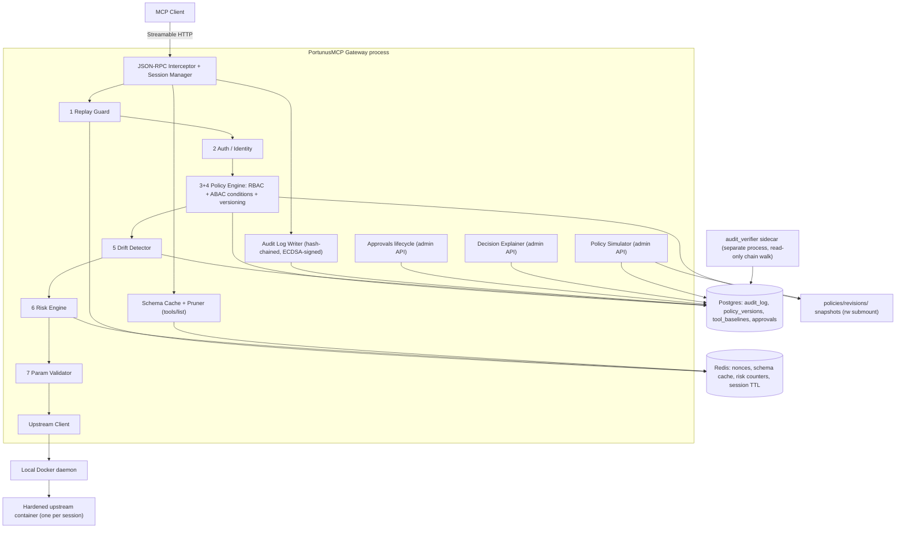

# PortunusMCP

**A policy-enforcing gateway proxy for the Model Context Protocol (MCP)** — identity-scoped tool visibility, schema-drift ("rug pull") detection, per-call risk scoring, and a tamper-evident signed audit trail, with no changes required to the upstream MCP server.

[](https://github.com/BashaarJavaid/PortunusMCP/actions/workflows/ci.yml)
-brightgreen)

[](./LICENSE)


*A low-privilege identity sees only the tools it's allowed. The upstream server rug-pulls its own schema mid-session. The gateway classifies the drift as Critical, blocks the call, and holds it for human re-approval. A byte-identical replay is rejected. Finally, a draft policy is simulated against the traffic that just happened.*

---

## Why

MCP defines a JSON-RPC 2.0 transport between LLM clients and tool servers, but deliberately leaves authorization, auditability, and integrity out of scope — it assumes the deploying org builds that layer. In practice almost nobody does, which leaves three concrete gaps:

1. **No identity-scoped tool visibility.** Any client that can reach a server gets the server's full `tools/list`. There is no native "this user should only see a subset of tools."
2. **Rug pulls.** A server can change a tool's schema *after* a human approved it in a prior session, with nothing to detect the drift.
3. **No audit trail.** Nothing records which identity invoked which tool with which arguments, under which policy, in a form you could later prove wasn't edited.

PortunusMCP sits between the two and closes those three.

### Client compatibility

**Neither side needs changes.** The upstream server is proxied as-is, and a stock Claude Desktop, Cursor, or SDK `ClientSession` works unmodified under the default `bearer` auth mode — RBAC, ABAC, drift blocking, risk scoring, parameter validation, and the signed audit trail are all fully enforced on every call (the integration suite runs an unpatched SDK client end to end). Auth posture is per-identity ([`ROADMAP.md`](./ROADMAP.md) item 34): identities that can adopt a small signing client opt into `signed` mode, where the request carries a non-secret key id plus an HMAC over the call — no credential on the wire at all, which is what makes replay protection real (a captured request cannot be re-signed with a fresh nonce). The tradeoff is honest: `bearer` = zero client changes, key rides the request; `signed` = custom client, capture-proof.

---

## Architecture

Every box inside the gateway is a module in `services/gateway/` with the same name; numbered stages are the decision pipeline in `ARCHITECTURE.md` §4.2 order. Sequence, deployment, and data-flow diagrams live in §4.4–§4.7.



**Multiple upstreams are registered in the policy's `servers:` block** as typed container specifications, versioned and rolled back with the rest of the policy. Clients connect to `/mcp/<server_id>`; one session owns one hardened upstream container. RBAC grants, drift baselines, schema caches, risk counters, approvals, and runtime fingerprints are keyed on the real `server_id`.

```yaml
servers:
  github:
    image: "ghcr.io/acme/github-mcp@sha256:..."
    command: ["python", "-m", "github_mcp"]
    env:
      GITHUB_TOKEN: PORTUNUSMCP_UPSTREAM_GITHUB_TOKEN
    volumes:
      - source: "portunusmcp-upstream-dev-github-config"
        target: "/config"
    network: none
    resources: {memory_mb: 256, cpus: 0.5, pids: 64}
```

The local Docker daemon, every referenced image, and every named volume are preflighted before policy activation; images are never pulled at runtime. Containers run as UID 65532 with a read-only root, a restricted `/tmp`, no new privileges, no capabilities, and bounded memory/CPU/PIDs. Environment values can only come from host variables prefixed `PORTUNUSMCP_UPSTREAM_`; gateway database, signing, TOTP, and audit-key secrets are not inherited. Network defaults to `none`. See [ADR-007](./docs/adr/ADR-007-upstream-container-isolation.md).

---

## Threat model (summary)

The full version, including the assumptions the whole model rests on, is in [`THREAT_MODEL.md`](./THREAT_MODEL.md). It is deliberately explicit about what is *not* covered — an honest scope boundary is worth more than an implied claim of total coverage.

| Threat | Protected? | How / why not |
|---|---|---|
| Unauthorized tool access by a known identity | Yes | RBAC + ABAC policy resolution |
| Rogue / rug-pulling MCP server (schema mutation) | Yes | Drift Detector classifies mutations; High/Critical blocks at `tools/call` until re-approval |
| Contextually risky calls by an *authorized* identity | Yes | Risk Engine — challenge / human approval / deny, by score band |
| Audit-log tampering | Yes | Hash chain + per-row ECDSA signature; independently verified by a sidecar holding only the public key |
| Replay of a captured request | **Yes for `signed` / Partial for `bearer`** | A `signed` request carries no credential: a byte-identical replay is deduped (`DENY_REPLAY`) and a fresh nonce cannot be re-signed (401 at the edge). `bearer` keeps opportunistic dedup only — the API key travels in the captured request |
| Tool Poisoning (adversarial text in descriptions) | **Partial** | A description changed after approval blocks until re-approval (default High, item 36a); first-contact baselines are heuristically scanned — a hit is audited (`BASELINE_FLAGGED`) and raises every later call's risk, but flags never block and novel phrasing evades pattern lists. Descriptions still reach the LLM verbatim — Partial is the ceiling |
| Compromised registered upstream reading gateway secrets | **Yes (scoped)** | Per-session hardened containers receive a minimal allowlisted environment and no gateway secrets directory, Docker socket, or DB/Redis credentials; host/gateway compromise remains out of scope |
| DNS rebinding against Streamable HTTP | **Yes (scoped)** | The MCP SDK validates every `/mcp/*` Host and supplied Origin against configured allowlists before auth or parsing; the deployment must configure its real public names |
| Authenticated resource exhaustion / stuck tools | **Partial** | Per-identity sessions, in-flight calls, fixed-window rate limits, bounded bodies/depth, and a 60s call deadline cap one identity; many identities can still exhaust the host, and a deadline cannot undo an upstream side effect already started |
| Prompt injection via tool *results* | Partial | A protocol-layer gateway can log and rate-limit but not semantically evaluate result content — client/agent-framework responsibility |
| Stolen API key | Partial | Behavioral risk factors reduce blast radius; a key alone can't be distinguished from its holder. A `signed` identity's secret never appears on the wire at all — stealing it means compromising a host environment |
| Compromised gateway host | No | The attacker has the signing key — an infra hardening problem, not an application one |
| Insider admin abusing legitimate access | No | Attributable and tamper-evident after the fact, not prevented; two-person activation is designed, not built |

---

## Run the demo

```bash
cp .env.demo.example .env.demo
python scripts/generate_signing_key.py   # once: audit signing keypair (gateway won't start without it)
python scripts/run_demo.py               # resets demo state, mints keys, writes policies/demo-policy.yaml, waits
```

```bash
# First set UPSTREAM_RUNTIME_NAMESPACE and DOCKER_GID in .env.demo. Find the GID with:
# docker run --rm -v /var/run/docker.sock:/var/run/docker.sock docker:29.6.1-cli \
#   stat -c '%g' /var/run/docker.sock
#
# In another terminal (the rogue upstream container lives in the policy's servers: block):
POLICY_FILE=policies/demo-policy.yaml \
  docker compose --env-file .env.demo -f compose.demo.yml up -d --build

# when the driver prompts — the rug pull, deliberately on screen:
curl -X POST localhost:9800/_admin/apply_mutation

# when it prompts again — hot-load the tightened v2 policy for the simulation finale:
docker kill -s HUP portunusmcp-demo-gateway-1
```

The driver connects as `developer` — a stock MCP client, no custom `_meta` on the first call (sees only `send_email` / `read_inbox`; the destructive `delete_mailbox` is *absent*, not marked), then as `ops-admin` (sees all three). It makes a successful call, waits for the operator's mutation curl, then shows the drift classified Critical and blocked (`DENY_DRIFT`), the admin re-approval, and the same call succeeding after a TOTP step-up if current risk requires it. It then shows the `signed` ci-agent's captured request replayed byte-identically (`DENY_REPLAY`) and with a forged fresh nonce (HTTP 401), followed by Policy Simulation of the v2 draft (`would_now_deny: 2`) and the hash-chained audit receipts.

All seven beats are live — nothing is scripted or faked. The mutation fires only when the operator actually calls that endpoint, so the adversarial event is visible on camera rather than happening off-screen on a timer.

If later demo policy v1 content conflicts with recorded state, the fail-closed activation check refuses startup and names the dev-only reset: `docker compose --env-file .env.demo -f compose.demo.yml run --rm gateway python scripts/reset_dev_state.py --yes`. The check is not weakened.

**Development setup:** `python3.12 -m venv .venv && .venv/bin/pip install -e ".[dev]"`, copy `.env.demo.example` to `.env.demo`, set its required Docker namespace/GID values, build the local upstream image with `docker build -t portunusmcp:dev .`, then run `.venv/bin/pytest`. The mounted Docker socket is root-equivalent access to the host; only trusted operators should receive a shell in the gateway container. Full command list in [`CLAUDE.md`](./CLAUDE.md).

## Self-host the production profile

`compose.prod.yml` is a hardened **single-host, single-gateway-replica** profile. It is intentionally not selected by a bare `docker compose up`: every invocation names the production file and env explicitly.

```bash
cp .env.prod.example .env.prod
cp .env.prod.gateway.example .env.prod.gateway
chmod 600 .env.prod .env.prod.gateway
# Fill every required password, digest, allowlist, path, namespace and Docker GID.

docker compose --env-file .env.prod -f compose.prod.yml config
docker compose --env-file .env.prod -f compose.prod.yml pull
docker compose --env-file .env.prod -f compose.prod.yml up -d
```

Release workflow summaries print the exact immutable gateway reference. The official Postgres, Redis, Prometheus and Grafana repositories publish their manifest digests; place those `sha256:...` values in `.env.prod`. Every production `servers:` image should likewise be `repository@sha256:...` and must already exist on the host because runtime pulling is disabled.

The active policy is mounted as one read-only file. On Linux, make the private key owned by UID/GID 1000 with mode `0400`, the revision directory owned by 1000:1000 with mode `0700`, and the active policy/public key read-only (`0444`). The verifier receives only the public key. `.env.prod.gateway` contains only policy-referenced `PORTUNUSMCP_UPSTREAM_*`, signing and TOTP secrets. Postgres and Redis are password-protected and reachable only on the internal data network; neither publishes a host port.

The gateway binds to `127.0.0.1:${GATEWAY_PORT:-8000}`. Put an operator-managed TLS reverse proxy in front of it and set `ALLOWED_HOSTS`/`ALLOWED_ORIGINS` to the real public names. Internal gateway-to-database traffic is plaintext inside the isolated single-host Compose network.

Optional production monitoring also stays loopback-only and requires a Grafana login:

```bash
docker compose --env-file .env.prod -f compose.prod.yml --profile monitoring up -d
```

Do not scale `gateway`: session/container handles are in memory and the audit chain has one safe writer. The direct Docker socket remains root-equivalent host access. Named volumes persist data but are not backups; backup/restore, TLS termination, host patching and log shipping remain operator responsibilities.

### Resource controls and readiness

`GET /health` is process liveness only. `GET /ready` concurrently checks Postgres, Redis, and an in-memory signing/verification probe, returning 200 only when all three are ready (otherwise 503):

```json
{"status":"ready","checks":{"postgres":"ok","redis":"ok","signing":"ok"}}
```

The item-40 settings are environment-backed; all numeric values must be positive, and allowlists are JSON arrays:

| Setting | Default |
|---|---:|
| `MAX_MCP_BODY_BYTES` | `1048576` |
| `MAX_JSON_DEPTH` | `32` |
| `MAX_SESSIONS_PER_IDENTITY` | `3` |
| `MAX_INFLIGHT_CALLS_PER_IDENTITY` | `5` |
| `TOOL_CALL_RATE_LIMIT` / `TOOL_CALL_RATE_WINDOW_SECONDS` | `60` / `60` |
| `TOOL_CALL_DEADLINE_SECONDS` | `60` |
| `READINESS_TIMEOUT_SECONDS` | `1.0` |
| `ALLOWED_HOSTS` | `["localhost:*","127.0.0.1:*"]` |
| `ALLOWED_ORIGINS` | `[]` |

A missing `Origin` remains valid for non-browser MCP clients. Any supplied Origin must be listed.

---

## Performance

Measured, not estimated, on **2026-07-27** from the item-40 working tree based on **`d12ddb2`**, with real per-session Docker upstreams and the full §4.2 pipeline plus item-40 edge/rate/deadline controls active. Methodology, hardware, and reproduction steps: [`ARCHITECTURE.md` §9](./ARCHITECTURE.md#9-performance-benchmarks).

| Scenario | Direct call | Through gateway | Overhead |
|---|---|---|---|
| Single call, cached schema | 0.28 / 0.22 / 0.54 / 1.11 ms | 16.75 / 16.18 / 18.12 / 31.53 ms | 16.47 / 15.95 / 17.58 / 30.42 ms |
| Single call, cold schema cache | 0.28 / 0.22 / 0.54 / 1.11 ms | 19.57 / 18.93 / 21.86 / 44.81 ms | — |
| 10 concurrent sessions (p95) | — | 145.98 ms | — |
| 50 concurrent sessions (p95) | — | 761.38 ms | — |
| 100 concurrent sessions (p95) | — | 2090.04 ms | — |
| `tools/list` payload (pruned identity) | 744 B (unpruned) | 425 B | **42.9% reduction** |

Latencies are mean / p50 / p95 / p99. The high-concurrency p95 includes one hardened Docker container per session as well as the synchronous fail-closed audit write; both are known ceilings, discussed in `ARCHITECTURE.md` §10.

Container initialization: first 544.45 ms; next 20 p50 442.97 ms / p95 868.89 ms. Peak RSS after the 100-session run was 212 MiB (gateway + harness); initialized upstream containers used 1,095 MiB in aggregate.

---

## Tech stack

| Layer | Choice | Why |
|---|---|---|
| Runtime | Python 3.12, FastAPI + Starlette, async throughout | First-party MCP SDK; async-native for a proxy that's almost entirely I/O wait |
| MCP handling | `mcp` official Python SDK | Don't hand-roll JSON-RPC framing — intercept at the session layer instead |
| Storage | PostgreSQL 16 (audit chain, baselines, approvals, policy versions) + Redis 7 (nonces, schema cache, risk counters) | Relational integrity matters for a hash chain; Redis for everything with a TTL |
| Policy | YAML + Pydantic, with a hand-rolled ABAC expression evaluator (`ast.parse` + node whitelist, no `eval`) | Git-diffable and validated at load. Deliberately not Turing-complete — no loops, no recursion, no code execution ([ADR-004](./docs/adr/ADR-004-no-opa-for-v1.md) on why not OPA) |
| Risk | Fixed weighted factor list + behavioral Redis counters — **no ML, by design** | A security decision an operator can't explain is a security decision they can't trust |
| Crypto | SHA-256 hash chain + ECDSA P-256 per-row signatures | The chain alone is regenerable by anyone with DB write access; the signature isn't |
| Ops | Docker Compose, Prometheus + Grafana (opt-in profile), structlog JSON logs, GitHub Actions (ruff / mypy strict / pytest with an 80% coverage gate) | |

---

## Documentation

- [`ARCHITECTURE.md`](./ARCHITECTURE.md) — decision pipeline, every component in depth, failure modes, observability, benchmarks, scalability, testing, deployment
- [`THREAT_MODEL.md`](./THREAT_MODEL.md) — what's protected, what isn't, and the assumptions underneath
- [`SECURITY.md`](./SECURITY.md) — vulnerability disclosure
- [`docs/adr/`](./docs/adr/) — one file per consequential decision, including why Envoy, OPA, Kong, NGINX, sidecars, and client-SDK middleware were each rejected for v1
- [`ROADMAP.md`](./ROADMAP.md) — the build order as a living checklist

## Roadmap

Phases 1–5 are complete. **Phase 6 is making the adopted gateway honestly self-hostable.** Items 39–41 provide the upstream isolation boundary, bounded HTTP/session/call lifecycles, dependency-aware readiness, and separate explicit demo/production Compose profiles. Item 42, the operator CLI/API, is next.

Each item in [`ROADMAP.md`](./ROADMAP.md) states the check that proves it done and the threat-model row it upgrades — **an item is finished when that row can be honestly rewritten, not when the code merges.**

## License

MIT — see [`LICENSE`](./LICENSE).
